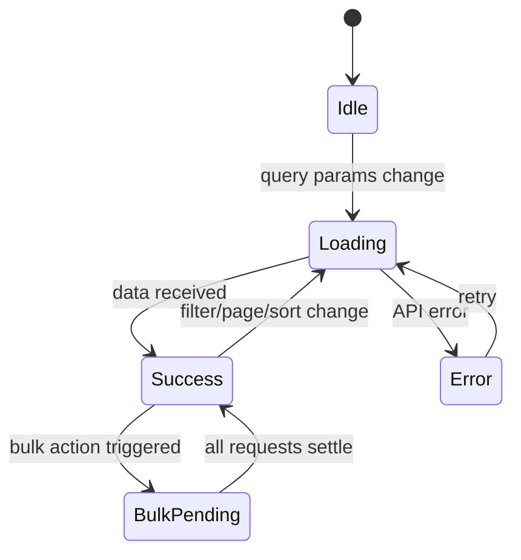

# Design Document: admin-entries

## Overview

The admin-entries feature upgrades the `/entries` admin page from a simple table with basic filters into a full-featured list view that matches the visual quality and interaction patterns of the existing Categories page. The work spans three layers:

1. **API extension** — the `GET /api/v1/admin/entries` endpoint must return five new flat-projection fields (`type`, `category_id`, `category_name`, `tags`, `languages`) and support `type` / `category_id` filter query params.
2. **API client update** — extend the TypeScript `Entry` interface and `ListEntriesParams` in `entries.ts`, and add `listEntryCategories()` as a thin wrapper over the categories API.
3. **Frontend page overhaul** — replace the current page with stat cards, status tabs, filter row, sortable table with checkbox selection, bulk-action bar, per-row actions, and a pagination footer — all mirroring the categories page patterns already in the codebase.

### Design Goals

- Zero new patterns introduced: every UI element mirrors a counterpart already in the categories page or shared UI library.
- Two independent data fetches: a filterable list query (`['entries', params]`) and a static summary query (`['entries-summary']`), exactly as the requirements specify.
- Strict type safety from backend to UI: the extended `Entry` interface makes new fields visible to TypeScript throughout.

---

## Architecture

### Data Flow

```mermaid
flowchart TD
    subgraph Browser
        P[EntriesPage]
        SQ[Summary Query\n'entries-summary']
        LQ[List Query\n'entries', params]
        CQ[Categories Query\n'entry-categories']
        P --> SQ
        P --> LQ
        P --> CQ
    end

    subgraph API
        E1[GET /api/v1/admin/entries\n?status=&type=&category_id=&q=&page=&limit=]
        E2[GET /api/v1/admin/entries\n?limit=1&page=1 (summary totals)]
        C1[GET /api/v1/admin/categories\n?type=entry&limit=200]
    end

    LQ -->|params| E1
    SQ -->|no filter params| E2
    CQ --> C1
```

The summary query calls the same entries endpoint but without filter params (a separate dedicated `/summary` endpoint is not assumed to exist; instead the page makes a separate `listEntries` call with the specific status it needs to count, or—more practically—uses a dedicated summary endpoint if available, with a fallback to four parallel count calls). See the Components section for the implementation choice.

### State Machine



---

## Components and Interfaces

### File Layout

```
apps/admin/src/
├── app/(dashboard)/entries/
│   └── page.tsx                          ← full page overhaul
├── components/entries/
│   └── entry-type-badge.tsx              ← new component
└── lib/api/
    └── entries.ts                        ← extended types + listEntryCategories
```

### `entries.ts` — API Client Extensions

The existing file is extended in-place; no breaking changes to existing fields.

```ts
// Extended Entry interface
export interface Entry {
  id: string;
  type: EntryType;
  origin_language: string;
  status: EntryStatus;
  metadata: { skill_level?: SkillLevel; [key: string]: unknown };
  term?: string | null;
  slug?: string | null;
  // NEW flat projections (list endpoint only)
  category_id?: string | null;
  category_name?: string | null;
  tags?: Array<{ id: string; name: string }>;
  languages?: string[];
  // Detail-only fields
  translations: Translation[];
  content_blocks: ContentBlock[];
  created_at: string;
  updated_at: string;
}

// Extended ListEntriesParams
export interface ListEntriesParams {
  locale?: string;
  page?: number;
  limit?: number;
  status?: EntryStatus;
  skillLevel?: SkillLevel;
  originLanguage?: string;
  q?: string;
  // NEW filter params
  type?: EntryType;
  category_id?: string;
}

// New function — thin wrapper over adminCategoriesApi
// Imported from categories.ts to avoid code duplication
export function listEntryCategories(): Promise<ApiResponse<AdminCategory[]>> {
  return adminCategoriesApi.listCategories({ type: 'entry', limit: 200 });
}
```

**Design decision**: `listEntryCategories` lives in `entries.ts` (not `categories.ts`) to keep all entry-page dependencies co-located, but it delegates to `adminCategoriesApi.listCategories` rather than making a raw fetch call, avoiding duplication of the auth header / base-URL logic.

### `EntryTypeBadge` Component

Located at `apps/admin/src/components/entries/entry-type-badge.tsx`. Mirrors `CategoryTypeBadge` exactly — same shape, sizing classes, and inline-style approach.

```ts
export type EntryType = "stitch" | "technique" | "tool" | "tradition" | "yarn_weight";

const TYPE_COLORS: Record<string, { bg: string; color: string }> = {
  stitch:      { bg: '#EDE7FF', color: '#7F6BBF' },
  technique:   { bg: '#DBEAFE', color: '#1D4ED8' },
  tool:        { bg: '#FEF3C7', color: '#B45309' },
  tradition:   { bg: '#D1FAE5', color: '#065F46' },
  yarn_weight: { bg: '#FCE7F3', color: '#9D174D' },
};

const NEUTRAL = { bg: '#F1F5F9', color: '#64748B' };

const TYPE_LABELS: Record<string, string> = {
  stitch:      'Stitch',
  technique:   'Technique',
  tool:        'Tool',
  tradition:   'Tradition',
  yarn_weight: 'Yarn Weight',
};
```

**Design decision**: `TYPE_COLORS` is keyed as `Record<string, ...>` (not `Record<EntryType, ...>`) so the fallback path for unknown types doesn't require a type cast. The label map is likewise `Record<string, string>` with a fallback of the raw value.

### `EntriesPage` — Key State

```ts
// Filter state
const [searchInput, setSearchInput] = useState('');   // raw input (debounced)
const [q, setQ]                     = useState('');   // debounced search param
const [statusFilter, setStatusFilter] = useState<EntryStatus | 'all'>('all');
const [activeTab, setActiveTab]       = useState<'all' | 'published' | 'draft' | 'review'>('all');
const [typeFilter, setTypeFilter]     = useState<EntryType | 'all'>('all');
const [categoryFilter, setCategoryFilter] = useState<string | 'all'>('all');

// Pagination
const [page, setPage]       = useState(1);
const [pageSize, setPageSize] = useState(10);

// Sort
const [sortKey, setSortKey]             = useState<string | null>(null);
const [sortDirection, setSortDirection] = useState<SortDirection>(null);

// Selection
const [selectedIds, setSelectedIds] = useState<Set<string>>(new Set());

// Dialogs
const [deleteTarget, setDeleteTarget]   = useState<Entry | null>(null);
const [statusTarget, setStatusTarget]   = useState<Entry | null>(null);
const [bulkDeleteOpen, setBulkDeleteOpen] = useState(false);
```

**Design decision**: `activeTab` and `statusFilter` are kept as separate state. `activeTab` drives the visual tab highlight; `statusFilter` is the actual API param. They are kept in sync: clicking a tab sets `statusFilter` to the mapped value, and setting `statusFilter` to `deprecated` (from outside the tabs) leaves `activeTab` as `'all'` so no tab appears active.

### Queries

```ts
// Summary — independent of filter state (runs once, refetches on mutation invalidation)
const { data: summaryData, isLoading: summaryLoading } = useQuery({
  queryKey: ['entries-summary'],
  queryFn: () => entriesApi.listEntries({ limit: 1 }),  // we rely on meta.total
  // Note: the summary requires 4 status-specific counts; we make 4 parallel queries
});

// For the four stat cards we make 4 parallel summary queries:
const summaryQueries = useQueries({
  queries: [
    { queryKey: ['entries-summary', 'all'],       queryFn: () => entriesApi.listEntries({ limit: 1 }) },
    { queryKey: ['entries-summary', 'published'],  queryFn: () => entriesApi.listEntries({ limit: 1, status: 'published' }) },
    { queryKey: ['entries-summary', 'draft'],      queryFn: () => entriesApi.listEntries({ limit: 1, status: 'draft' }) },
    { queryKey: ['entries-summary', 'review'],     queryFn: () => entriesApi.listEntries({ limit: 1, status: 'review' }) },
  ],
});

// List — depends on all filter/page/sort state
const params: ListEntriesParams = {
  page,
  limit: pageSize,
  ...(q            ? { q }                        : {}),
  ...(statusFilter !== 'all' ? { status: statusFilter } : {}),
  ...(typeFilter !== 'all'   ? { type: typeFilter }     : {}),
  ...(categoryFilter !== 'all' ? { category_id: categoryFilter } : {}),
  // sort params passed when sortKey is set
};

const { data, isLoading, isError } = useQuery({
  queryKey: ['entries', params],
  queryFn:  () => entriesApi.listEntries(params),
});

// Categories for dropdown
const { data: catData, isLoading: catLoading, isError: catError } = useQuery({
  queryKey: ['entry-categories'],
  queryFn:  () => listEntryCategories(),
});
```

**Design decision**: Summary stats use four parallel queries via `useQueries` (with `limit: 1` to minimise data transfer) rather than a single fetch and client-side grouping. This matches the requirement that stats are independent of the filter state, and the API already supports per-status filtering. Each query gets a stable `queryKey` so invalidation after mutations refreshes all four.

### Bulk Action Bar

Rendered inside `<TableFooter>` replacing the normal `TableFooterBar` when `selectedIds.size > 0`. Not a separate component file — defined inline in the page as a local sub-component, consistent with how `ChangeStatusDialog` and `SkeletonRows` are handled in the existing codebase.

```tsx
// Bulk Action Bar replaces TableFooterBar when selectedIds.size > 0
function BulkActionBar({ selectedIds, onStatusChange, onDeleteOpen }: ...) {
  return (
    <div className="flex items-center justify-between px-4 py-3">
      <p className="text-sm font-medium text-slate-700">
        {selectedIds.size} selected
      </p>
      <div className="flex items-center gap-2">
        {/* Status dropdown */}
        <Select onValueChange={onStatusChange}>
          <SelectTrigger className="w-[160px] h-8 text-sm">
            <SelectValue placeholder="Status" />
          </SelectTrigger>
          <SelectContent>
            {['draft','review','published','deprecated'].map(s => (
              <SelectItem key={s} value={s}>{STATUS_LABELS[s]}</SelectItem>
            ))}
          </SelectContent>
        </Select>
        {/* Actions dropdown */}
        <DropdownMenu>
          <DropdownMenuTrigger asChild>
            <Button variant="outline" size="sm">Actions <ChevronDown size={14} /></Button>
          </DropdownMenuTrigger>
          <DropdownMenuContent align="end">
            <DropdownMenuItem className="text-red-600" onClick={onDeleteOpen}>
              Delete selected
            </DropdownMenuItem>
          </DropdownMenuContent>
        </DropdownMenu>
      </div>
    </div>
  );
}
```

---

## Data Models

### API Response Shape (Extended)

```ts
// Each item in GET /api/v1/admin/entries response
interface EntryListItem {
  id: string;
  type: EntryType | null;
  origin_language: string;
  status: EntryStatus;
  metadata: { skill_level?: SkillLevel; [key: string]: unknown };
  term: string | null;
  slug: string | null;
  category_id: string | null;      // NEW
  category_name: string | null;    // NEW — en-locale category translation name
  tags: Array<{ id: string; name: string }>;  // NEW — en-locale tag names
  languages: string[];             // NEW — locales with at least one Translation
  created_at: string;
  updated_at: string;
}

interface ListEntriesResponse {
  data: EntryListItem[];
  meta: {
    total: number;
    page: number;
    limit: number;
  };
}
```

### Filter → Query Param Mapping

| UI State | API param |
|---|---|
| `activeTab = 'published'` | `status=published` |
| `typeFilter = 'stitch'` | `type=stitch` |
| `categoryFilter = '<uuid>'` | `category_id=<uuid>` |
| `q = 'knit'` | `q=knit` |
| Sort by `title` asc | `sortBy=term&sortDir=asc` (if supported) |

### Selection Model

The selection state is a `Set<string>` of entry IDs. It is persisted across page, sort, and filter changes within the same component mount. It is cleared only after a successful bulk action or when the component unmounts.

```ts
// Header checkbox derived state
const allOnPageSelected = entries.length > 0 && entries.every(e => selectedIds.has(e.id));
const someOnPageSelected = entries.some(e => selectedIds.has(e.id));
const headerIndeterminate = someOnPageSelected && !allOnPageSelected;
```

### Status → Tab Mapping

```ts
const STATUS_TO_TAB: Record<EntryStatus | 'all', string> = {
  all:        'all',
  published:  'published',
  draft:      'draft',
  review:     'needs-review',
  deprecated: 'all',   // no dedicated tab — falls back to 'all', but matched tab != 'deprecated' so no tab shows active
};
```

Note: when `statusFilter === 'deprecated'`, the `Tabs value` prop is set to `'deprecated'` (a string that matches no `TabsTrigger` value), ensuring no tab appears highlighted.

---

## Correctness Properties

*A property is a characteristic or behavior that should hold true across all valid executions of a system — essentially, a formal statement about what the system should do. Properties serve as the bridge between human-readable specifications and machine-verifiable correctness guarantees.*

### Property 1: Type filter returns only matching entries

*For any* valid `EntryType` value passed as a filter, every item in the response array from `GET /api/v1/admin/entries` shall have a `type` field equal to that filter value.

**Validates: Requirements 1.6**

### Property 2: Category filter returns only matching entries

*For any* valid UUID passed as `category_id` filter, every item in the response array shall have a `category_id` field equal to that UUID (or an empty array if no entries belong to that category).

**Validates: Requirements 1.8**

### Property 3: Invalid enum values return HTTP 400

*For any* string that is not a member of `EntryType` or `EntryStatus`, passing it as the respective query parameter shall result in an HTTP 400 response and no partial data.

**Validates: Requirements 1.9**

### Property 4: EntryTypeBadge color mapping is exhaustive and correct

*For any* value in `EntryType`, the `EntryTypeBadge` component shall render an element whose `style.backgroundColor` and `style.color` exactly match the values specified in the `TYPE_COLORS` mapping.

**Validates: Requirements 3.2**

### Property 5: EntryTypeBadge label mapping uses explicit strings

*For any* value in `EntryType`, the rendered text content of `EntryTypeBadge` shall equal the value in `TYPE_LABELS` (e.g. `"yarn_weight"` → `"Yarn Weight"`), never the raw underscore-delimited string.

**Validates: Requirements 3.3**

### Property 6: EntryTypeBadge unknown type fallback renders without error

*For any* string not in `EntryType`, rendering `EntryTypeBadge` shall produce a valid React element displaying the raw string with the neutral grey style (`#F1F5F9` / `#64748B`) rather than throwing or returning null.

**Validates: Requirements 3.5**

### Property 7: File import validation rejects non-CSV and oversized files

*For any* file, the import handler shall accept it (proceed without error toast) if and only if the file's name ends with `.csv` AND the file's size is ≤ 5,242,880 bytes (5 MB); otherwise it shall show the appropriate error toast and clear the file input.

**Validates: Requirements 4.4, 4.5**

### Property 8: Summary stat counts are independent of active filters

*For any* combination of active filter state (search, type, category, status tab), the four summary stat queries shall not include those filter parameters — the counts must reflect the full dataset.

**Validates: Requirements 5.2**

### Property 9: "Needs review" stat card count equals review-status entry count

*For any* dataset, the value displayed in the "Needs review" stat card shall equal the number of entries whose `status === "review"` in that dataset.

**Validates: Requirements 5.5**

### Property 10: Tab click sets correct status filter and resets page

*For any* tab value ("All entries", "Published", "Draft", "Needs review"), clicking that tab shall set `statusFilter` to the mapped `EntryStatus` value (`'all'`, `'published'`, `'draft'`, `'review'` respectively) and reset `page` to 1.

**Validates: Requirements 6.2, 6.3, 6.4, 6.5**

### Property 11: Active tab reflects status filter — bidirectional consistency

*For any* `statusFilter` value, the `Tabs` component's `value` prop shall equal the tab key that corresponds to that status; if the status has no corresponding tab (e.g. `'deprecated'`), then no `TabsTrigger` value shall match and no tab shall appear active.

**Validates: Requirements 6.6, 6.7**

### Property 12: Search debounce — query updates only after 300 ms of inactivity

*For any* sequence of keystrokes in the search input with inter-key intervals less than 300 ms, the `q` query parameter shall not update until 300 ms have elapsed after the last keystroke; at that point it shall update to the current input value and reset `page` to 1.

**Validates: Requirements 7.1**

### Property 13: hasFilters is true iff at least one filter is active

*For any* combination of `searchInput` (with or without non-whitespace characters), `typeFilter` (any value), and `categoryFilter` (any value), `hasFilters` shall be `true` if and only if at least one of: `searchInput` contains a non-whitespace character, `typeFilter !== 'all'`, or `categoryFilter !== 'all'`.

**Validates: Requirements 7.6, 7.7, 7.8**

### Property 14: Clear filters resets all filter state to defaults

*For any* active filter state (any combination of non-default search, type, and category values), clicking "Clear filters" shall set `searchInput` to `""`, `typeFilter` to `'all'`, `categoryFilter` to `'all'`, `activeTab` to `'all'`, and `page` to 1.

**Validates: Requirements 7.10**

### Property 15: Title column displays term or fallback

*For any* `Entry` object, the Title cell in the table shall display `entry.term` if it is a non-null, non-empty string; otherwise it shall display the string `"—"`.

**Validates: Requirements 8.2**

### Property 16: Tags column renders up to 3 tags and correct overflow badge

*For any* array of tags of length N: if N ≤ 3, exactly N tag badges shall be rendered and no overflow badge shall appear; if N > 3, exactly 3 tag badges shall be rendered plus one overflow badge whose text content is `"+${N - 3}"`.

**Validates: Requirements 8.5**

### Property 17: Status badge color and label mapping is correct

*For any* value in `EntryStatus`, the rendered status badge shall have `style.backgroundColor` and `style.color` matching the `STATUS_COLORS` mapping, and the displayed text shall equal the human-readable label (e.g. `"review"` → `"Needs review"`, `"deprecated"` → `"Deprecated"`).

**Validates: Requirements 8.6**

### Property 18: Updated column date format is "MMM D, YYYY" in en-US

*For any* valid ISO 8601 date string, the formatted value in the Updated column shall match the pattern produced by `toLocaleDateString('en-US', { month: 'short', day: 'numeric', year: 'numeric' })` — e.g. `"2025-06-05T10:00:00Z"` → `"Jun 5, 2025"`.

**Validates: Requirements 8.7**

### Property 19: Sort direction cycles through unsorted → asc → desc → unsorted

*For any* sortable column key, clicking the corresponding `SortableTableHead` once shall set direction to `'asc'`; clicking again shall set it to `'desc'`; clicking a third time shall set both `sortKey` to `null` and `sortDirection` to `null`; only one column shall have a non-null direction at any time.

**Validates: Requirements 8.9**

### Property 20: Header checkbox state is derived correctly from selection and page

*For any* set of selected IDs and any array of entries on the current page: the header checkbox shall be fully checked iff all entries on the page are in the selection set; it shall show an indeterminate state iff at least one but fewer than all entries on the page are selected; it shall be unchecked iff no entries on the page are selected.

**Validates: Requirements 9.1, 9.2, 9.3**

### Property 21: Bulk action partial failure toasts reflect correct counts

*For any* bulk operation where S requests succeed and F requests fail (S + F = N total), the page shall display a success toast for S (if S > 0) and an error toast for F (if F > 0); failed IDs shall remain in the selection set.

**Validates: Requirements 9.8**

### Property 22: Selection persists across filter, sort, and page changes

*For any* selection set and any filter/sort/page change action, the selection set shall be identical before and after the action (no IDs added or removed by the navigation action itself).

**Validates: Requirements 9.9**

### Property 23: Page resets to 1 on page-size change

*For any* `pageSize` change (to any of 10, 20, 50, 100), `page` shall be reset to 1 regardless of the previous page value.

**Validates: Requirements 11.3**

---

## Error Handling

### API Errors — Entries List

When `useQuery` for the list returns an error, the page displays a toast error message using `sonner`'s `toast.error(...)`. The table body renders neither skeleton rows nor the "No entries found" empty state — it renders nothing (an empty `<TableBody>`), consistent with Requirement 12.2.

```ts
const { data, isLoading, isError } = useQuery({ ... });

useEffect(() => {
  if (isError) toast.error('Failed to load entries');
}, [isError]);
```

### API Errors — Categories Dropdown

When `catError` is true, the Category `Select` remains disabled and a toast error fires once. The rest of the page (table, tabs, other filters) continues to function normally.

### Mutation Errors — Delete / Status Change

Per-row and bulk mutations use `onError` callbacks to fire `toast.error(...)`. The affected row remains in its pre-mutation state. The `ConfirmDialog` or status dialog stays open so the user can retry or cancel.

For bulk operations, errors are collected after all requests settle (`Promise.allSettled`) and then reported:

```ts
const results = await Promise.allSettled(
  [...selectedIds].map(id => entriesApi.deleteEntry(id))
);
const succeeded = results.filter(r => r.status === 'fulfilled').length;
const failed    = results.filter(r => r.status === 'rejected').length;
if (succeeded > 0) toast.success(`${succeeded} entr${succeeded === 1 ? 'y' : 'ies'} deleted`);
if (failed > 0)    toast.error(`${failed} entr${failed === 1 ? 'y' : 'ies'} could not be deleted`);
```

### HTTP 400 on Invalid Enum

The backend returns HTTP 400 for invalid `type` or `status` values. On the frontend this surfaces as a React Query error, triggering the same error toast path described above. No special UI treatment is needed beyond the generic error toast.

---

## Testing Strategy

### Unit Tests

Unit tests cover concrete examples, edge cases, and rendering logic:

- `EntryTypeBadge` renders with correct label and classes for each of the 5 valid types and the unknown-type fallback.
- `StatusBadge` renders correct colour and label for each of the 4 status values.
- `formatDate` produces correct `"MMM D, YYYY"` output for representative dates.
- `hasFilters` returns `true`/`false` for representative filter combinations.
- Tag rendering: 0 tags → no badges; 3 tags → 3 badges; 4 tags → 3 badges + "+1".
- `ChangeStatusDialog` pre-populates the current status and calls `onConfirm` with the selected value.
- `ConfirmDialog` shows "Deleting…" label and disables the confirm button while `loading={true}`.
- Skeleton rows: exactly 5 skeleton rows rendered during loading.
- Empty state: `FileX` icon and "No entries found" text rendered when `data = []` and not loading.

### Property-Based Tests

This feature includes significant pure function logic (badge mappings, filter derivations, tag overflow rendering, date formatting, sort cycling, selection state) that is well-suited to property-based testing.

**Recommended library**: [fast-check](https://fast-check.dev/) (already in the JavaScript ecosystem; install with `pnpm add -D fast-check`).

**Configuration**: minimum 100 iterations per property test.

**Tag format for each test**:
```
// Feature: admin-entries, Property N: <property text>
```

Property tests to implement (one test function per property):

| # | Property | What the generator produces |
|---|---|---|
| 4 | EntryTypeBadge color mapping | `fc.constantFrom(...EntryTypeValues)` |
| 5 | EntryTypeBadge label mapping | `fc.constantFrom(...EntryTypeValues)` |
| 6 | EntryTypeBadge unknown type fallback | `fc.string().filter(s => !EntryTypeValues.includes(s))` |
| 7 | File import validation | `fc.record({ name: fc.string(), size: fc.integer({ min: 0, max: 10_000_000 }) })` |
| 13 | hasFilters derivation | `fc.record({ search: fc.string(), type: fc.option(...), category: fc.option(...) })` |
| 15 | Title column term/fallback | `fc.option(fc.string({ minLength: 1 }))` for `term` |
| 16 | Tags overflow badge | `fc.array(tagArbitrary)` with varying length |
| 17 | Status badge color/label | `fc.constantFrom(...EntryStatusValues)` |
| 18 | Date formatting | `fc.date({ min: new Date('2000-01-01'), max: new Date('2099-12-31') })` |
| 19 | Sort direction cycle | `fc.array(fc.constantFrom('title','type','updated'), { minLength: 1, maxLength: 20 })` |
| 20 | Header checkbox state | `fc.set(fc.uuid())` for selectedIds + `fc.array(entryArbitrary)` for page |
| 21 | Bulk partial failure toasts | `fc.array(fc.boolean())` for success/failure pattern |
| 22 | Selection persists across navigation | `fc.set(fc.uuid())` + `fc.record(filterChangeArbitrary)` |
| 23 | Page reset on page-size change | `fc.integer({ min: 1 })` for current page, `fc.constantFrom(10,20,50,100)` for new size |

Properties 1–3 (API contract) are best validated with integration tests against the real or mocked backend, not property-based tests in the frontend.

Properties 8–12 (summary independence, tab ↔ status sync, debounce) require React component testing with a test runner such as `@testing-library/react` combined with fast-check's `fc.assert`.

### Integration Tests

- Category dropdown: mock `listEntryCategories` and verify the `Select` is populated with the correct options.
- Bulk status update: mock N `updateEntryStatus` calls, trigger bulk action, verify N calls are made with the correct IDs and status.
- Bulk delete: mock N `deleteEntry` calls, confirm dialog, verify N calls.
- Per-row delete: mock `deleteEntry`, confirm dialog, verify one call with the correct ID.
- Per-row status change: mock `updateEntryStatus`, confirm dialog, verify call with correct params.
- Query invalidation: after successful mutation, `['entries', params]` and `['entries-summary', *]` query keys are invalidated.
