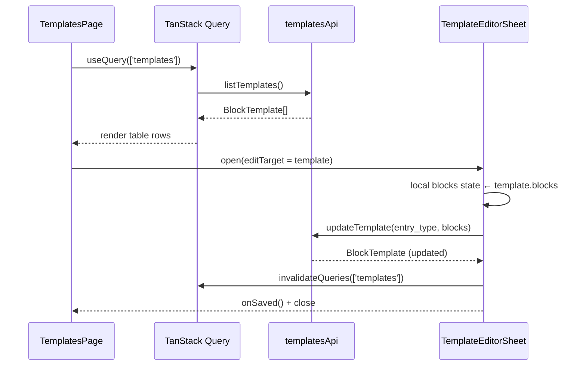
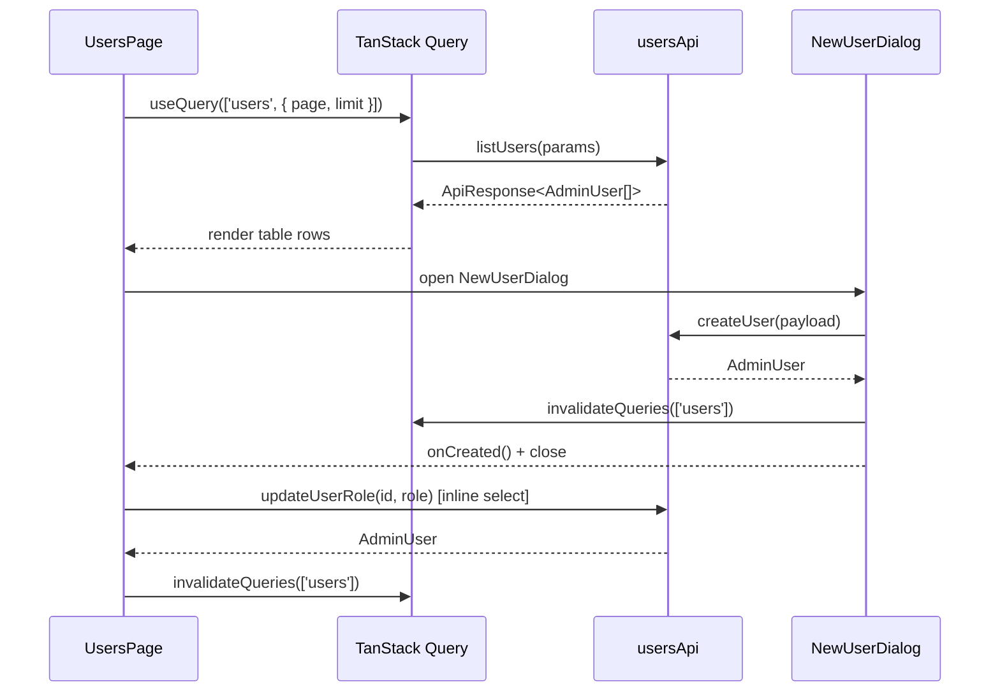

# Design Document — Phase H: Settings (Admin Role Only)

## Overview

Phase H adds two admin-only pages to the dashboard: a block template editor (`/settings/templates`) and a user management page (`/users`). Both pages are already linked in the sidebar under the SETTINGS section with `adminOnly: true`, so no sidebar changes are needed.

All API clients are already implemented and fully typed: `src/lib/api/templates.ts` and `src/lib/api/users.ts`. The pages follow the established patterns from the articles section (list + dialog/sheet) and the Blocks tab in the entry editor (block list + add/toggle).

Access control is enforced at the UI layer via `useAuthStore` — both routes check `currentUser.role === 'admin'` and redirect non-admin users to `/dashboard`.

---

## Architecture

### File structure to create

```
src/
  app/(dashboard)/
    settings/
      templates/
        page.tsx              ← H1: Block templates list + Sheet editor (Client Component)
    users/
      page.tsx                ← H2: User management list + New User dialog (Client Component)
  components/settings/
    template-editor-sheet.tsx ← Slide-out Sheet for editing a single template's blocks
    new-user-dialog.tsx       ← Dialog form for creating a new user
```

No changes needed to:
- `src/lib/api/templates.ts` — already has `listTemplates()` and `updateTemplate()`
- `src/lib/api/users.ts` — already has `listUsers()`, `createUser()`, `updateUserRole()`
- `src/components/layout/sidebar.tsx` — already has both nav items with `adminOnly: true`

---

## Component Design

### `settings/templates/page.tsx` — Block Templates List

**Pattern:** mirrors `articles/page.tsx` (list table + row action opens a panel).

**Role guard:** reads `currentUser.role` from `useAuthStore`. If not `'admin'`, calls `router.replace('/dashboard')` in a `useEffect`.

**State:**
- `editTarget: BlockTemplate | null` — template currently open in the Sheet editor

**Data fetching:**
```ts
useQuery({
  queryKey: ['templates'],
  queryFn: () => templatesApi.listTemplates(),
})
```

**Table columns:** Entry Type, Block Count, Last Updated, Actions

**Entry Type cell:** rendered as a `<Badge variant="outline" className="capitalize">` (values: stitch, technique, tool, tradition, yarn_weight).

**Last Updated cell:** formatted with `toLocaleDateString('en-GB', { day: 'numeric', month: 'short', year: 'numeric' })`.

**Row click / Edit action:** sets `editTarget` to the clicked template, opening the Sheet.

**No delete action** — templates are permanent per entry type; only their block lists are editable.

**Skeleton:** 5 skeleton rows while `isLoading`.

**Empty state:** Settings icon + "No templates found" when `templates.length === 0` and not loading.

---

### `components/settings/template-editor-sheet.tsx` — Template Block Editor

**Pattern:** shadcn `Sheet` (slide-out from the right), mirrors the Blocks tab in `entries/[id]/page.tsx`.

**Props:**
```ts
interface TemplateEditorSheetProps {
  template: BlockTemplate | null;
  open: boolean;
  onOpenChange: (open: boolean) => void;
  onSaved: () => void;  // called after successful save to invalidate query
}
```

**Internal state:**
- `blocks: BlockTemplateItem[]` — local copy of the template's blocks, initialised from `template.blocks` when the Sheet opens (reset on each open via `useEffect([template])`)
- `newBlockType: string` — selected type for the "Add block" control

**Block list rendering:** mirrors `BlocksTab` in the entry editor:
- Each row: order number, type badge, visibility toggle checkbox, remove button (×)
- Drag-to-reorder is **deferred** — use up/down arrow buttons instead (simpler, no DnD library needed)

**Up/Down reorder:** clicking ↑ swaps the block with the one above it; ↓ swaps with the one below. Updates the `order` field to match the new array index (1-based).

**Visibility toggle:** checkbox labelled "Visible" — toggles `block.visible`.

**Remove block:** removes the block from the local array; renumbers `order` fields.

**Add block:**
```ts
const BLOCK_TYPE_OPTIONS = ['definition', 'technique', 'media', 'callout', 'related', 'pattern_usage'];
```
Select + "Add" button appends a new block `{ type, order: blocks.length + 1, visible: true }`.

**Warning banner:** amber `Alert` component at the top of the Sheet body:
```
⚠ Changes apply to new entries only. Existing entries are not affected.
```

**Save mutation:**
```ts
useMutation({
  mutationFn: () => templatesApi.updateTemplate(template.entry_type, blocks),
  onSuccess: () => {
    toast.success('Template saved');
    onSaved();
    onOpenChange(false);
  },
  onError: () => toast.error('Failed to save template'),
})
```

**Sheet layout:**
- `SheetHeader`: title = "Edit Template: {entry_type}" (capitalised)
- `SheetContent` (side="right", className="w-[480px] sm:max-w-[480px]"): warning banner + block list + add block row
- `SheetFooter`: Cancel button + Save button (disabled while `isPending`)

---

### `users/page.tsx` — User Management

**Pattern:** mirrors `articles/page.tsx` (list table + "New" button opens a Dialog).

**Role guard:** same as templates page — redirect non-admin to `/dashboard`.

**State:**
- `newUserOpen: boolean` — controls the New User dialog
- `page: number` — current page

**Data fetching:**
```ts
useQuery({
  queryKey: ['users', { page, limit: PAGE_SIZE }],
  queryFn: () => usersApi.listUsers({ page, limit: PAGE_SIZE }),
})
```
`listUsers` returns `ApiResponse<AdminUser[]>` (with `meta.total`), so pagination works the same as the articles list.

**Table columns:** Name, Email, Role (badge), Created At, Actions

**Role badge colours:**
```ts
const ROLE_BADGE_STYLES: Record<UserRole, string> = {
  admin:    'bg-purple-50 text-purple-700 border-purple-200',
  editor:   'bg-blue-50   text-blue-700   border-blue-200',
  reviewer: 'bg-slate-100 text-slate-600  border-slate-200',
};
```
Rendered as a `<span>` with `inline-flex items-center rounded-full border px-2 py-0.5 text-xs font-medium capitalize` — same pattern as `StatusBadge` in the entry editor.

**Inline role change:** the Role cell renders a `<Select>` (not a static badge) with the current role pre-selected. On `onValueChange`, fires the `updateRoleMutation` immediately (no separate save button).

```ts
const updateRoleMutation = useMutation({
  mutationFn: ({ id, role }: { id: string; role: UserRole }) =>
    usersApi.updateUserRole(id, role),
  onSuccess: () => {
    toast.success('Role updated');
    queryClient.invalidateQueries({ queryKey: ['users'] });
  },
  onError: () => toast.error('Failed to update role'),
});
```

**Skeleton:** 5 skeleton rows while `isLoading`.

**Empty state:** Users icon + "No users found".

**Pagination:** same prev/next + "Page X of Y" pattern as articles.

---

### `components/settings/new-user-dialog.tsx` — New User Dialog

**Pattern:** shadcn `Dialog`, mirrors the pattern used in other admin dialogs.

**Props:**
```ts
interface NewUserDialogProps {
  open: boolean;
  onOpenChange: (open: boolean) => void;
  onCreated: () => void;  // called after successful create to invalidate query
}
```

**Internal state:**
- `name: string`
- `email: string`
- `password: string`
- `role: UserRole` — default `'reviewer'`
- `errors: Record<string, string>`

**Validation (on submit):**
- `email`: required, must match basic email pattern — "Valid email is required."
- `password`: required, minimum 8 characters — "Password must be at least 8 characters."
- `role`: always valid (select with fixed options)
- `name`: optional

**Create mutation:**
```ts
useMutation({
  mutationFn: () => usersApi.createUser({ name, email, password, role }),
  onSuccess: () => {
    toast.success('User created');
    onCreated();
    onOpenChange(false);
    // reset form state
  },
  onError: () => toast.error('Failed to create user'),
})
```

**Form reset:** on dialog close (`onOpenChange(false)`), reset all fields and errors.

**Dialog layout:**
- `DialogHeader`: title = "New User"
- `DialogContent` (className="sm:max-w-[440px]"): Name (optional Input), Email (required Input), Password (required Input type="password"), Role (Select)
- `DialogFooter`: Cancel + "Create User" button (disabled while `isPending`)

---

## Components and Interfaces

### `TemplateEditorSheetProps`

```typescript
interface TemplateEditorSheetProps {
  template: BlockTemplate | null;
  open: boolean;
  onOpenChange: (open: boolean) => void;
  onSaved: () => void;
}
```

### `NewUserDialogProps`

```typescript
interface NewUserDialogProps {
  open: boolean;
  onOpenChange: (open: boolean) => void;
  onCreated: () => void;
}
```

### `RoleBadge` (inline, not a separate file)

```typescript
const ROLE_BADGE_STYLES: Record<UserRole, string> = {
  admin:    'bg-purple-50 text-purple-700 border-purple-200',
  editor:   'bg-blue-50   text-blue-700   border-blue-200',
  reviewer: 'bg-slate-100 text-slate-600  border-slate-200',
};

function RoleBadge({ role }: { role: UserRole }) {
  return (
    <span className={cn(
      'inline-flex items-center rounded-full border px-2 py-0.5 text-xs font-medium capitalize',
      ROLE_BADGE_STYLES[role]
    )}>
      {role}
    </span>
  );
}
```

---

## Data Models

### `BlockTemplate` (from `src/lib/api/templates.ts`)

```typescript
interface BlockTemplateItem {
  type: string;    // e.g. 'definition', 'technique', 'media', 'callout', 'related', 'pattern_usage'
  order: number;   // 1-based position in the list
  visible: boolean;
  [key: string]: unknown;
}

interface BlockTemplate {
  entry_type: EntryType;   // 'stitch' | 'technique' | 'tool' | 'tradition' | 'yarn_weight'
  blocks: BlockTemplateItem[];
  block_count: number;
  updated_at: string;      // ISO 8601
}
```

### `AdminUser` (from `src/lib/api/users.ts`)

```typescript
type UserRole = 'admin' | 'editor' | 'reviewer';

interface AdminUser {
  id: string;
  name?: string;
  email: string;
  role: UserRole;
  created_at: string;  // ISO 8601
}
```

### `NewUserFormState` (internal to `NewUserDialog`)

```typescript
interface NewUserFormState {
  name: string;
  email: string;
  password: string;
  role: UserRole;
  errors: {
    email?: string;
    password?: string;
  };
}
```

---

## Error Handling

### Template save failure

**Condition**: `PUT /api/v1/admin/settings/templates/:entry_type` returns a non-2xx response.
**Response**: Show an error toast via Sonner ("Failed to save template"). Keep the Sheet open with the current local block edits intact.
**Recovery**: User can retry the save or close the Sheet to discard changes.

### User create failure

**Condition**: `POST /api/v1/admin/users` returns a non-2xx response.
**Response**: Show an error toast ("Failed to create user"). Keep the dialog open with the current field values intact.
**Recovery**: User can correct the input and retry.

### Role update failure

**Condition**: `PATCH /api/v1/admin/users/:id` returns a non-2xx response.
**Response**: Show an error toast ("Failed to update role"). The user list is re-fetched (query invalidation does not happen on error), so the select reverts to the server-side role on the next render.
**Recovery**: User can attempt the role change again.

### Non-admin access

**Condition**: A user with `role !== 'admin'` navigates directly to `/settings/templates` or `/users`.
**Response**: Client-side `useEffect` calls `router.replace('/dashboard')` immediately.
**Recovery**: N/A — user is redirected away.

---

## Testing Strategy

### Unit Testing Approach

Test the pure block-manipulation logic (add, reorder, remove, renumber) as standalone functions extracted from the component, or via component state assertions. Key test cases:
- Adding a block to an empty list produces `order: 1`
- Adding a block to a list of N produces `order: N + 1`
- Removing the middle block renumbers remaining blocks correctly
- Moving the first block down swaps it with the second

### Property-Based Testing Approach

**Property Test Library**: Vitest + fast-check

Property tests focus on universal invariants that hold across all valid inputs:
- Block order renumbering: `blocks[i].order === i + 1` after any mutation
- Visibility toggle: only the targeted block's `visible` changes
- Role badge colour: correct tokens present, wrong tokens absent
- Form validation: invalid inputs always rejected, valid inputs always accepted

### Integration Testing Approach

Not applicable for this phase — both pages are pure client-side React with mocked API calls. End-to-end flows are covered by the existing Playwright setup (if present) or manual testing.

---

## Data Flow Diagrams

### H1 — Block Templates



### H2 — User Management



---

## TanStack Query Keys

| Key | Used by |
|---|---|
| `['templates']` | Templates list page, invalidated after save |
| `['users', { page, limit }]` | Users list page, invalidated after create or role update |

---

## Role Guard Pattern

Both pages use the same guard at the top of the component:

```ts
const currentUser = useAuthStore((s) => s.currentUser);
const router = useRouter();

useEffect(() => {
  if (currentUser && currentUser.role !== 'admin') {
    router.replace('/dashboard');
  }
}, [currentUser, router]);
```

This is a client-side guard. The sidebar already hides the nav items for non-admin users, so this guard handles direct URL access.

---

## Correctness Properties

*A property is a characteristic or behavior that should hold true across all valid executions of a system — essentially, a formal statement about what the system should do. Properties serve as the bridge between human-readable specifications and machine-verifiable correctness guarantees.*

### Property 1: Template table row count matches data

*For any* non-empty array of `BlockTemplate` objects returned by `listTemplates()`, the rendered table SHALL contain exactly one row per template, and each row SHALL display the correct `entry_type`, `block_count`, and formatted `updated_at` values.

**Validates: Requirements 1.3**

### Property 2: Sheet block list renders all blocks

*For any* `BlockTemplate` with any number of `BlockTemplateItem` entries, opening the Template_Editor_Sheet SHALL render exactly one list item per block, and each item SHALL display the correct `type`, `order`, and `visible` state from the source block.

**Validates: Requirements 1.6**

### Property 3: Block order renumbering invariant

*For any* block list and any sequence of add, reorder (up or down), or remove operations, the `order` field of every block in the resulting array SHALL equal its 1-based position (i.e., `blocks[i].order === i + 1` for all valid `i`).

**Validates: Requirements 2.3, 2.4, 2.6**

### Property 4: Visibility toggle flips the boolean

*For any* block list and any valid block index, toggling the visibility checkbox SHALL set that block's `visible` field to the logical negation of its previous value, and SHALL leave all other blocks' `visible` fields unchanged.

**Validates: Requirements 2.5**

### Property 5: Save payload equals local blocks state

*For any* sequence of edits made to the block list in the Template_Editor_Sheet, the blocks array passed to `updateTemplate()` on save SHALL be deeply equal to the current local blocks state at the moment the Save button is clicked.

**Validates: Requirements 1.8**

### Property 6: User table row count matches data

*For any* non-empty array of `AdminUser` objects returned by `listUsers()`, the rendered table SHALL contain exactly one row per user, and each row SHALL display the correct `name`, `email`, `role`, and formatted `created_at` values.

**Validates: Requirements 3.3**

### Property 7: Role select pre-populated with current role

*For any* `AdminUser` with any `UserRole` value, the inline role select rendered in that user's table row SHALL have its value pre-set to the user's current `role` field.

**Validates: Requirements 5.1**

### Property 8: Role badge colour matches role

*For any* `AdminUser` with a given `UserRole`, the rendered role badge class string SHALL contain the colour tokens defined for that role (`purple` for `admin`, `blue` for `editor`, `slate`/grey for `reviewer`), and SHALL NOT contain colour tokens belonging to any other role.

**Validates: Requirements 6.1, 6.2, 6.3, 6.4**

### Property 9: Invalid email rejected by New User dialog

*For any* string that does not match a basic email pattern (i.e., does not contain `@` with non-empty local and domain parts), submitting the New_User_Dialog with that string in the Email field SHALL display a validation error on the Email field and SHALL NOT call `createUser()`.

**Validates: Requirements 4.3**

### Property 10: Short password rejected by New User dialog

*For any* string of length less than 8 characters, submitting the New_User_Dialog with that string in the Password field SHALL display a validation error on the Password field and SHALL NOT call `createUser()`.

**Validates: Requirements 4.4**

### Property 11: New User dialog resets on close

*For any* state of the New_User_Dialog (any combination of field values and validation errors), closing the dialog SHALL reset all field values to empty strings and clear all validation errors, so that reopening the dialog presents a blank form.

**Validates: Requirements 4.7**
