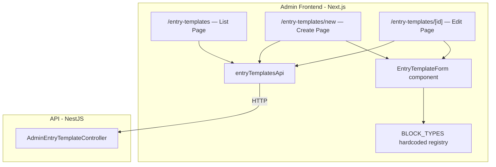
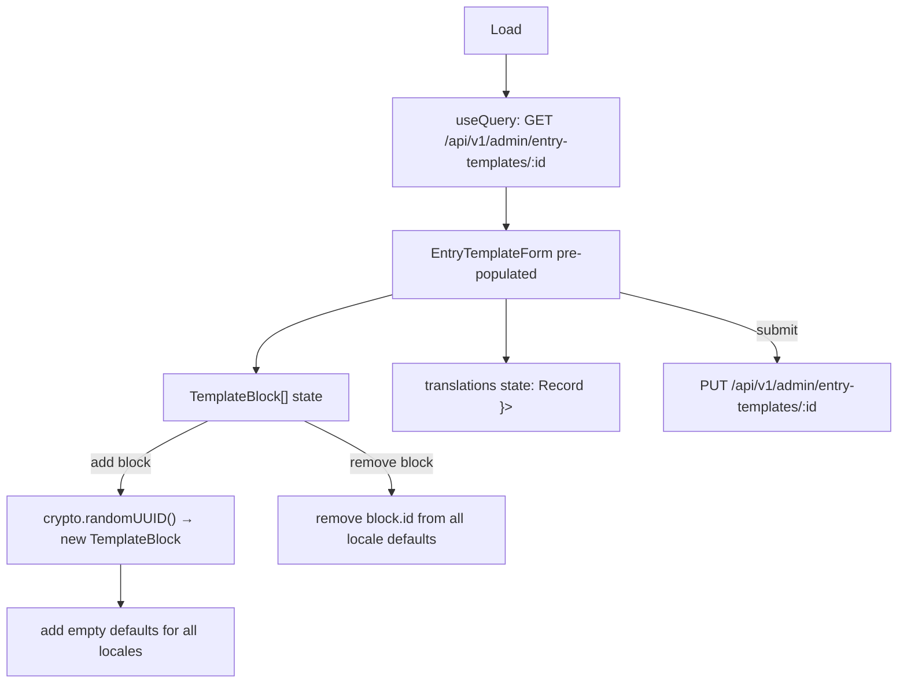

# Design Document: Entry Templates with Translations

## Overview

This document covers the full redesign of the Entry Templates feature:

- **`/entry-templates`** — searchable/sortable list page with EN/PL translation status columns
- **`/entry-templates/new`** — create page
- **`/entry-templates/[id]`** — edit page

The `ContentBlockType` database entity and the `/content-blocks` admin page are **removed**. Block type metadata (label, field schema) is now a hardcoded frontend registry (`BLOCK_TYPES`). Each block inside a template carries a stable client-generated `id`; per-locale default values (e.g. heading text) are stored in `EntryTemplate.translations[locale].blocks_defaults[block.id]`.

The `CategoryForm` component and the categories pages remain the direct reference for layout, state management, and UX patterns.

---

## Architecture



### Data Flow — Entry Template Edit



---

## File Layout

```
apps/admin/src/
├── lib/api/
│   └── entry-templates.ts              ← REWRITE: add translations to types and API
├── components/
│   └── entry-templates/
│       └── entry-template-form.tsx     ← REWRITE: add translations tab section
├── app/(dashboard)/
│   ├── content-blocks/                 ← DELETE entire directory
│   └── entry-templates/
│       ├── page.tsx                    ← UPDATE: add EN/PL translation status columns
│       ├── new/
│       │   └── page.tsx                ← UPDATE: pass translations in payload
│       └── [id]/
│           └── page.tsx                ← UPDATE: pass translations in payload
```

---

## BlockType Registry (Frontend-Only)

Defined as a constant in `src/lib/block-types.ts` (or co-located in `entry-templates.ts`).

```typescript
export interface BlockTypeField {
  name: string;       // e.g. "heading"
  label: string;      // e.g. "Header"
  maxLength: number;  // e.g. 255
}

export interface BlockTypeDescriptor {
  slug: string;               // e.g. "rich_text"
  label: string;              // e.g. "Rich Text"
  translatableFields: BlockTypeField[];
}

export const BLOCK_TYPES: BlockTypeDescriptor[] = [
  {
    slug: 'rich_text',
    label: 'Rich Text',
    translatableFields: [
      { name: 'heading', label: 'Header', maxLength: 255 },
    ],
  },
  // future: steps_list, image_gallery, video_gallery …
];

export function getBlockType(slug: string): BlockTypeDescriptor | undefined {
  return BLOCK_TYPES.find(bt => bt.slug === slug);
}
```

This replaces all usage of `contentBlockTypesApi.list()` in the form.

---

## API Client Layer

### `entry-templates.ts` (rewritten)

```typescript
import { apiGet, apiPost, apiPut, apiDelete } from './client';
import type { EntryType } from './entries';

export const SUPPORTED_LOCALES = ['en', 'pl'] as const;
export type Locale = typeof SUPPORTED_LOCALES[number];

// ---------------------------------------------------------------------------
// Types
// ---------------------------------------------------------------------------

export interface TemplateBlock {
  id: string;         // stable UUID, client-generated
  type: string;       // Block_Type_Slug (e.g. "rich_text")
  order: number;      // 1-based, contiguous
  required: boolean;
}

/**
 * All per-locale default values for all blocks, stored as a single JSON column.
 * Structure: { [blockId]: { [locale]: { [fieldName]: string } } }
 * Example:   { "uuid-1": { "en": { "heading": "Introduction" }, "pl": { "heading": "Wstęp" } } }
 */
export type TemplateTranslations = Record<string, Record<string, Record<string, string>>>;

export interface EntryTemplate {
  id: string;
  name: string;
  description?: string;
  entry_type: EntryType;
  blocks: TemplateBlock[];
  translations: TemplateTranslations;
  created_at: string;
  updated_at: string;
}

export interface CreateEntryTemplatePayload {
  name: string;
  description?: string;
  entry_type: EntryType;
  blocks?: TemplateBlock[];
  translations?: TemplateTranslations;
}

export type UpdateEntryTemplatePayload = Partial<CreateEntryTemplatePayload>;

// ---------------------------------------------------------------------------
// API client
// ---------------------------------------------------------------------------

export const entryTemplatesApi = {
  list: (): Promise<EntryTemplate[]> =>
    apiGet<EntryTemplate[]>('/api/v1/admin/entry-templates'),

  getById: (id: string): Promise<EntryTemplate> =>
    apiGet<EntryTemplate>(`/api/v1/admin/entry-templates/${id}`),

  create: (payload: CreateEntryTemplatePayload): Promise<EntryTemplate> =>
    apiPost<EntryTemplate>('/api/v1/admin/entry-templates', payload),

  update: (id: string, payload: UpdateEntryTemplatePayload): Promise<EntryTemplate> =>
    apiPut<EntryTemplate>(`/api/v1/admin/entry-templates/${id}`, payload),

  delete: (id: string): Promise<void> =>
    apiDelete<void>(`/api/v1/admin/entry-templates/${id}`),

  upsertTranslation: (
    id: string,
    locale: Locale,
    blockTranslations: Record<string, Record<string, string>>,
    // e.g. { "uuid-1": { "heading": "Introduction" }, "uuid-2": { "heading": "Steps" } }
  ): Promise<EntryTemplate> =>
    apiPut<EntryTemplate>(
      `/api/v1/admin/entry-templates/${id}/translations/${locale}`,
      blockTranslations,
    ),
};
```

**TanStack Query key conventions:**
- `['entry-templates']` — list
- `['entry-templates', id]` — single item

---

## Translation Status Derivation

```typescript
export type TranslationStatus = 'complete' | 'incomplete' | 'missing';

export function deriveTemplateTranslationStatus(
  template: Pick<EntryTemplate, 'blocks' | 'translations'>,
  locale: Locale,
): TranslationStatus {
  // Check if any block has data for this locale
  const hasAny = template.blocks.some(
    block => template.translations[block.id]?.[locale] !== undefined,
  );
  if (!hasAny) return 'missing';

  const allComplete = template.blocks.every(block => {
    const blockType = getBlockType(block.type);
    if (!blockType) return true; // unknown types don't block completion
    return blockType.translatableFields.every(field => {
      const val = template.translations[block.id]?.[locale]?.[field.name];
      return typeof val === 'string' && val.trim().length > 0;
    });
  });

  return allComplete ? 'complete' : 'incomplete';
}
```

---

## Block List Pure Helpers

Exported from `entry-template-form.tsx` for property-based testing.

```typescript
export function renumber(blocks: TemplateBlock[]): TemplateBlock[] {
  return blocks.map((b, i) => ({ ...b, order: i + 1 }));
}

export function moveUp(blocks: TemplateBlock[], index: number): TemplateBlock[] {
  if (index <= 0 || index >= blocks.length) return blocks;
  const next = [...blocks];
  [next[index - 1], next[index]] = [next[index]!, next[index - 1]!];
  return renumber(next);
}

export function moveDown(blocks: TemplateBlock[], index: number): TemplateBlock[] {
  if (index < 0 || index >= blocks.length - 1) return blocks;
  const next = [...blocks];
  [next[index], next[index + 1]] = [next[index + 1]!, next[index]!];
  return renumber(next);
}

export function removeBlock(blocks: TemplateBlock[], index: number): TemplateBlock[] {
  return renumber(blocks.filter((_, i) => i !== index));
}

export function addBlock(blocks: TemplateBlock[], type: string): TemplateBlock[] {
  return [
    ...blocks,
    { id: crypto.randomUUID(), type, order: blocks.length + 1, required: false },
  ];
}

export function toggleRequired(blocks: TemplateBlock[], index: number): TemplateBlock[] {
  return blocks.map((b, i) => (i === index ? { ...b, required: !b.required } : b));
}
```

### Translation state helpers

```typescript
/** Adds an empty entry for blockId across all locales in translations */
export function initBlockDefaults(
  current: TemplateTranslations,
  blockId: string,
): TemplateTranslations {
  // Just ensure the key exists; existing locale data for other blocks is untouched
  return { ...current, [blockId]: current[blockId] ?? {} };
}

/** Removes a block id entirely from translations */
export function removeBlockDefaults(
  current: TemplateTranslations,
  blockId: string,
): TemplateTranslations {
  const { [blockId]: _removed, ...rest } = current;
  return rest;
}

/** Updates a single field value: translations[blockId][locale][fieldName] = value */
export function setTranslationField(
  current: TemplateTranslations,
  blockId: string,
  locale: string,
  fieldName: string,
  value: string,
): TemplateTranslations {
  return {
    ...current,
    [blockId]: {
      ...(current[blockId] ?? {}),
      [locale]: {
        ...(current[blockId]?.[locale] ?? {}),
        [fieldName]: value,
      },
    },
  };
}
```

---

## `EntryTemplateForm` Component

### Props

```typescript
export interface EntryTemplateFormValues {
  name: string;
  description: string;
  entry_type: EntryType | '';
  blocks: TemplateBlock[];
  translations: TemplateTranslations;
}

interface EntryTemplateFormProps {
  defaultValues?: Partial<EntryTemplateFormValues>;
  isSubmitting?: boolean;
  onSubmit: (values: EntryTemplateFormValues) => void | Promise<void>;
  onCancel?: () => void;
  onDelete?: () => void;
  title?: string;
}
```

Block types are resolved locally via `getBlockType(slug)` — no prop needed.

### State

```typescript
const [name, setName] = useState(defaultValues?.name ?? '');
const [description, setDescription] = useState(defaultValues?.description ?? '');
const [entryType, setEntryType] = useState<EntryType | ''>(defaultValues?.entry_type ?? '');
const [blocks, setBlocks] = useState<TemplateBlock[]>(defaultValues?.blocks ?? []);
const [translations, setTranslations] = useState<TemplateTranslations>(
  defaultValues?.translations ?? {},
);

const isSubmitDisabled = isSubmitting || !name.trim() || !entryType;
```

### Add / Remove block (with translation state sync)

```typescript
function handleAddBlock(type: string) {
  const newBlock = addBlock(blocks, type); // last item is the new one
  const newId = newBlock[newBlock.length - 1]!.id;
  setBlocks(newBlock);
  setTranslations(t => initBlockDefaults(t, newId));
}

function handleRemoveBlock(index: number) {
  const removedId = blocks[index]!.id;
  setBlocks(b => removeBlock(b, index));
  setTranslations(t => removeBlockDefaults(t, removedId));
}
```

### Layout — three sections (two-column matching `CategoryForm`)

```
Title row: [template name heading] .... [Delete?] [Cancel] [Save]
─────────────────────────────────────────────────────────────────
Left (flex-1):                       Right (w-[380px]):
┌──────────────────────────────┐     ┌────────────────────────────┐
│ Template details card         │     │ Entity type select          │
│  • Name (required)            │     │ (required)                  │
│  • Description (optional)     │     └────────────────────────────┘
└──────────────────────────────┘
┌──────────────────────────────┐
│ Template structure card       │
│  • Block list                 │
│  • + Add block                │
└──────────────────────────────┘
┌──────────────────────────────┐
│ Translations card             │
│  Tabs: EN | PL                │
│  Per tab: one heading input   │
│  per block, labelled by type  │
└──────────────────────────────┘
```

### Translations card

```tsx
<div className="rounded-lg border border-slate-200 bg-white p-5 space-y-4">
  <p className="text-sm font-semibold text-slate-700">Translations</p>
  <Tabs defaultValue="en">
    <TabsList variant="line" className="w-full justify-start">
      {SUPPORTED_LOCALES.map(locale => {
        const status = deriveTemplateTranslationStatus(
          { blocks, translations } as EntryTemplate, locale
        );
        return (
          <TabsTrigger key={locale} value={locale} variant="line" className="gap-1.5 items-center">
            <span
              className={cn(
                'h-1.5 w-1.5 rounded-full shrink-0 transition-colors',
                status === 'complete' ? 'bg-green-500' : 'bg-transparent',
              )}
              aria-hidden="true"
            />
            <span>{LOCALE_LABELS[locale]}</span>
          </TabsTrigger>
        );
      })}
    </TabsList>

    {SUPPORTED_LOCALES.map(locale => (
      <TabsContent key={locale} value={locale} className="pt-4 space-y-4">
        {blocks.length === 0 ? (
          <p className="text-sm text-slate-400">Add blocks to the structure first.</p>
        ) : (
          blocks.map(block => {
            const blockType = getBlockType(block.type);
            const blockLabel = blockType?.label ?? block.type;
            return (
              <div key={block.id} className="rounded-lg border border-slate-200 bg-white p-4 space-y-3">
                {/* Coloured block header preview */}
                <div className="flex items-center gap-2">
                  <span className="text-xs font-medium text-slate-500">{blockLabel}</span>
                  {!blockType && <TriangleAlert size={13} className="text-amber-500" />}
                </div>

                {/* Translatable field inputs */}
                {(blockType?.translatableFields ?? []).map(field => (
                  <div key={field.name} className="space-y-1.5">
                    <Label htmlFor={`${locale}-${block.id}-${field.name}`}>
                      {field.label}
                    </Label>
                    <Input
                      id={`${locale}-${block.id}-${field.name}`}
                      value={translations[block.id]?.[locale]?.[field.name] ?? ''}
                      onChange={e =>
                        setTranslations(t =>
                          setTranslationField(t, block.id, locale, field.name, e.target.value)
                        )
                      }
                      placeholder={`${LOCALE_LABELS[locale]} ${field.label.toLowerCase()} text`}
                      maxLength={field.maxLength}
                      disabled={isSubmitting}
                    />
                  </div>
                ))}
              </div>
            );
          })
        )}
      </TabsContent>
    ))}
  </Tabs>
</div>
```

---

## Entry Templates List Page (`/entry-templates/page.tsx`)

Same structure as before, with two added columns for translation status.

### Table columns

| Column | Value |
|---|---|
| Name | `template.name` — click navigates to edit |
| Entry Type | human-readable label |
| EN | `<TranslationStatusBadge status={deriveTemplateTranslationStatus(t, 'en')} />` |
| PL | `<TranslationStatusBadge status={deriveTemplateTranslationStatus(t, 'pl')} />` |
| Blocks | `template.blocks.length` |
| Updated | locale date string |
| Actions | Edit / Delete |

`TranslationStatusBadge` is the existing component from `src/components/content-blocks/translation-status-badge.tsx` — it can be moved to `src/components/ui/` since it is no longer content-blocks-specific.

---

## Data Model Changes

### Remove

- `ContentBlockType` model and table
- `ContentBlockTypeTranslation` model and table

### Update `EntryTemplate` in Prisma

```prisma
model EntryTemplate {
  id          String   @id @default(dbgenerated("gen_random_uuid()")) @db.Uuid
  name        String   @db.VarChar(255)
  description String?  @db.Text
  /// One of: stitch, technique, tool, tradition, yarn_weight
  entry_type  String
  /// Array of { id: uuid, type: string, order: number, required: boolean }
  blocks      Json     @default("[]")
  /// Nested translation defaults: { [blockId]: { [locale]: { [fieldName]: string } } }
  /// Example: { "uuid-1": { "en": { "heading": "Intro" }, "pl": { "heading": "Wstęp" } } }
  translations Json    @default("{}")
  created_at  DateTime @default(now()) @db.Timestamptz
  updated_at  DateTime @updatedAt @db.Timestamptz

  entries     Entry[]

  @@index([entry_type])
  @@map("entry_template")
}
```

No `EntryTemplateTranslation` table — all translation data lives in the `translations` JSON column alongside `blocks`. The entire template is one row.

---

## Error Handling

| Scenario | Response |
|---|---|
| `GET /entry-templates` fails | Error card + retry button + toast.error; table not rendered |
| `DELETE` non-2xx | toast.error("Failed to delete template"); list unchanged |
| `POST` non-2xx | toast.error; submit re-enabled; form stays open |
| `PUT` non-2xx | toast.error; field values preserved |
| `GET /:id` 404 | "Template not found" + back link |
| `GET /:id` other non-2xx | Error message + retry button |
| `DELETE /:id` non-2xx | toast.error; remain on page |
| 401 from any call | `client.ts` redirects to `/login` (existing behaviour) |

---

## Correctness Properties

### Property 1: `renumber` produces contiguous 1-based order

For any `TemplateBlock[]` of length N, `renumber(blocks)` produces a list where each item at 0-indexed position k has `order === k + 1`, and `id`, `type`, `required` are unchanged.

### Property 2: `moveUp` swaps and preserves contiguous order

For any list of length N ≥ 2 and index `i` in `(0, N)`, `moveUp(blocks, i)` produces a list where the item previously at `i` is at `i - 1`, the item previously at `i - 1` is at `i`, and every item has `order === position + 1`.

### Property 3: `moveDown` swaps and preserves contiguous order

For any list of length N ≥ 2 and index `i` in `[0, N - 1)`, `moveDown(blocks, i)` produces a list where the item previously at `i` is at `i + 1`, and every item has `order === position + 1`.

### Property 4: `moveUp` at index 0 is identity

For any list, `moveUp(blocks, 0)` returns a structurally equal list.

### Property 5: `moveDown` at last index is identity

For any list of length N, `moveDown(blocks, N - 1)` returns a structurally equal list.

### Property 6: `removeBlock` produces contiguous order and preserves other items

For any list of length N > 0 and valid index `i`, `removeBlock(blocks, i)` returns a list of length N - 1 where `blocks[i]` is absent and every remaining item has `order === position + 1`.

### Property 7: `toggleRequired` flips only the target item

For any list and valid index `i`, `toggleRequired(blocks, i)` returns a list where item `i` has `required === !blocks[i].required` and all other items are structurally equal to the originals.

### Property 8: `addBlock` appends with correct id, order, and required

For any list of length N and any type string, `addBlock(blocks, type)` returns a list of length N + 1 where the last item has `type === input`, `order === N + 1`, `required === false`, and a non-empty string `id`.

### Property 9: Submit button disabled invariant

For any `EntryTemplateForm` state, the submit button is disabled when `name` is empty-or-whitespace OR `entry_type` is `''`; enabled (with `isSubmitting === false`) when both are non-empty.

### Property 10: `removeBlockDefaults` removes the block id from translations

For any `TemplateTranslations` and a `blockId` present in it, `removeBlockDefaults(translations, blockId)` returns a map where `blockId` is no longer a key.

### Property 11: `initBlockDefaults` adds the block id to translations

For any `TemplateTranslations` and a new `blockId`, `initBlockDefaults(translations, blockId)` returns a map where `blockId` is a key (value is `{}` or existing data if already present).

---

## Testing Strategy

### Property-based tests (fast-check + vitest)

```typescript
const blockArb = fc.record({
  id: fc.uuidV(4),
  type: fc.stringMatching(/^[a-z][a-z0-9_]{0,20}$/),
  order: fc.integer({ min: 1, max: 100 }),
  required: fc.boolean(),
});
```

| Property | Generator |
|---|---|
| 1–8: block helpers | `fc.array(blockArb)` + index |
| 9: submit guard | `fc.record({ name: fc.string(), entry_type: fc.oneof(...) })` + RTL |
| 10: removeBlockDefaults | translation state arb + blockId |
| 11: initBlockDefaults | translation state arb + blockId |

### Unit tests (vitest + React Testing Library)

**Entry Templates list page:**
- Renders table with EN/PL status columns
- Status badge shows "Complete" / "Incomplete" / "Missing" correctly
- 5 skeleton rows while loading
- Error state with retry
- Empty state with "+ Add Template"
- Search filters by name
- Stats row shows per-type breakdown
- Row click navigates to edit page
- Delete confirmed: calls API, shows toast, refreshes list

**EntryTemplateForm:**
- Create mode: all fields empty; translation tabs empty
- Adding a block creates empty heading inputs in both locale tabs
- Removing a block removes heading inputs from both locale tabs
- Heading input updates only the targeted block/locale
- Submit disabled when name empty or entry_type unselected
- Block type label resolved from `BLOCK_TYPES`; warning shown for unknown slug

**Create page:**
- Submits correct payload including `translations`
- Navigates to `/entry-templates/[id]` on 201
- Shows error toast on non-2xx; form stays open

**Edit page:**
- Pre-populates blocks and translations from API response
- Submits full `translations` map on save
- Delete confirmed: navigates to list
