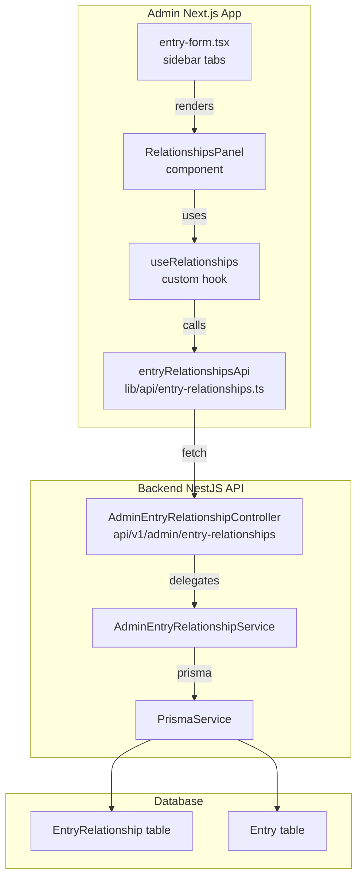

# Design Document: Entry Relationships Tab

## Overview

This feature adds a **Relationships** tab to the entry add/edit view in the admin application. The tab sits immediately after the existing "Images" tab in the right-side sidebar panel. It provides a self-contained UI (`RelationshipsPanel`) that lets editors search for other dictionary entries, choose a typed directional relationship, optionally attach a note, and save the link. Linked relationships are displayed in a grouped list organised by relationship type with remove support.

All relationship data is persisted through new backend REST endpoints backed by a new `EntryRelationship` Prisma model. The frontend accesses those endpoints through a new `entryRelationshipsApi` module that follows the exact same patterns as `entriesApi`, `tagsApi`, and `abbreviationsApi`.

### Research Summary

**Existing tab structure** (`apps/admin/src/components/entries/entry-form.tsx`): The right-side sidebar uses Radix UI `<Tabs>` with `variant="line"` and three tabs — `details`, `images`, `seo`. The Relationships tab is inserted between `images` and `seo`.

**API client pattern**: All API modules in `apps/admin/src/lib/api/` import `apiGet`, `apiPost`, `apiDelete`, etc. from `client.ts` and re-export typed wrapper objects. `ApiError` is imported from `client.ts` — the base `request()` function already throws it on non-OK responses, so each module inherits correct error behaviour automatically.

**Component patterns**: The `AbbreviationsPanel` and `TagsPanel` components demonstrate the canonical approach for search-link-list panels. Both use: a 300 ms debounce via `useEffect`+`setTimeout`, `@tanstack/react-query` `useMutation` for mutations, `sonner` toasts via `import { toast } from "sonner"`, and the shared `ConfirmDialog` component for destructive actions.

**Backend pattern**: New feature domains follow the `apps/api/src/admin/{feature}/` structure: a NestJS module, controller, service, and DTO files. The new `AdminEntryRelationshipModule` is registered in `app.module.ts`.

**Data model**: The Prisma schema already has a `RelatedEntry` model with a different shape (it uses the legacy `RelationType` enum and a `direction` field). The new feature requires a distinct `EntryRelationship` model with the new `EntryRelationshipType` enum, keeping the two models separate to avoid coupling to legacy code.

**Testing**: The project uses **Vitest** + **fast-check** for property-based tests. Existing property tests live in `apps/admin/src/lib/api/__tests__/*.property.test.ts`.

---

## Architecture



The panel is a pure client component. State management (loading, error, optimistic updates) lives inside the `useRelationships` custom hook. The hook uses React state (`useState`) and `useCallback`/`useEffect` — no React Query is needed for the list fetch because the refetch logic specified in Requirement 7 (queue-one-pending-refetch) is simpler to implement correctly with explicit state than with React Query's built-in refetch semantics.

Mutations (create, delete) use `@tanstack/react-query`'s `useMutation`, consistent with how `AbbreviationsPanel` handles mutations today.

---

## Components and Interfaces

### 1. `entry-form.tsx` — sidebar tab insertion

**Change**: Add a `relationships` tab trigger and content panel between `images` and `seo`.

```tsx
<TabsTrigger variant="line" value="relationships">Relationships</TabsTrigger>
// ...
<TabsContent value="relationships" className="mt-0 pt-4">
  <RelationshipsPanel
    entryId={entryId}
    activeLocale={activeLocale}
    readOnly={isSubmitting}
  />
</TabsContent>
```

The `isSubmitting` prop from the form becomes `readOnly` on the panel, preventing concurrent mutations while the entry itself is saving.

### 2. `RelationshipsPanel` — `apps/admin/src/components/entries/relationships-panel.tsx`

The main UI component for the tab content.

```typescript
interface RelationshipsPanelProps {
  /** The ID of the entry currently being edited. Undefined when the entry is unsaved. */
  entryId: string | undefined;
  /** The active locale code, used for display name resolution. */
  activeLocale: string;
  /** When true, all mutating controls are disabled (e.g. while the parent form is saving). */
  readOnly?: boolean;
}
```

Internal state:
- `targetEntry: Entry | null` — selected target entry from combobox
- `selectedType: EntryRelationshipType | null`
- `note: string`
- `searchInput: string`
- `searchResults: Entry[]`
- `isSearching: boolean`
- `deletingId: string | null` — ID of the relationship currently being deleted
- `confirmDeleteTarget: EntryRelationship | null` — drives confirm dialog

Hooks used:
- `useRelationships(entryId)` — provides `{ relationships, isLoading, isError, refetch, notifyMutated }`
- `useMutation` from `@tanstack/react-query` for `createRelationship` and `deleteRelationship`
- `useLanguages()` for default locale resolution
- 300 ms debounce pattern (same as `AbbreviationsPanel`) for search

### 3. `RelationshipCard` — sub-component (co-located in `relationships-panel.tsx`)

```typescript
interface RelationshipCardProps {
  relationship: EntryRelationship;
  displayName: string;
  /** True when a delete API call is in-flight for this specific card. */
  isDeleting: boolean;
  readOnly: boolean;
  onRemove: () => void;
}
```

Renders: target entry display name, relationship type label, optional note, and a remove button. The remove button is disabled when `isDeleting || readOnly`.

### 4. `useRelationships` hook — `apps/admin/src/components/entries/use-relationships.ts`

Manages the list fetch lifecycle, including the "queue-one-pending-refetch" logic from Requirement 7.

```typescript
interface UseRelationshipsResult {
  relationships: EntryRelationship[];
  isLoading: boolean;
  isError: boolean;
  retry: () => void;
  /** Call after a successful create or delete to trigger a refetch. */
  notifyMutated: () => void;
}

function useRelationships(entryId: string | undefined): UseRelationshipsResult
```

State machine:
- `isFetching: boolean` — true while a GET is in-flight
- `pendingRefetch: boolean` — set to true when a mutation completes during an active fetch

On `notifyMutated()`:
- If `!isFetching`, immediately call `fetchRelationships()`
- If `isFetching`, set `pendingRefetch = true`

On fetch completion:
- If `pendingRefetch === true`, clear flag and call `fetchRelationships()` again (once)

### 5. `entryRelationshipsApi` — `apps/admin/src/lib/api/entry-relationships.ts`

```typescript
export enum EntryRelationshipType {
  PREREQUISITE = 'PREREQUISITE',
  VARIANT_OF = 'VARIANT_OF',
  ALTERNATIVE_TO = 'ALTERNATIVE_TO',
  COMMONLY_CONFUSED_WITH = 'COMMONLY_CONFUSED_WITH',
  USED_IN = 'USED_IN',
  PART_OF = 'PART_OF',
  COUNTERPART_OF = 'COUNTERPART_OF',
  RELATED_TO = 'RELATED_TO',
}

export interface EntryRelationship {
  id: string;
  sourceEntryId: string;
  targetEntryId: string;
  type: EntryRelationshipType;
  note?: string;
  createdAt: Date;
}

export interface CreateRelationshipPayload {
  sourceEntryId: string;
  targetEntryId: string;
  type: EntryRelationshipType;
  note?: string;
}

export const entryRelationshipsApi = {
  listRelationships: (sourceEntryId: string): Promise<EntryRelationship[]>,
  createRelationship: (payload: CreateRelationshipPayload): Promise<EntryRelationship>,
  deleteRelationship: (id: string): Promise<void>,
};
```

`ApiError` is thrown automatically by the shared `request()` function in `client.ts` when the backend returns a non-2xx status. No special error-handling code is needed in this module.

### 6. Backend: `AdminEntryRelationshipController`

**Base route**: `api/v1/admin/entry-relationships`

| Method | Path | Description |
|--------|------|-------------|
| `GET` | `/` | List relationships. Accepts `?sourceEntryId=<uuid>` query param. Returns `EntryRelationship[]` wrapped in `{ data: [...] }` |
| `POST` | `/` | Create a new relationship. Body: `CreateRelationshipDto` |
| `DELETE` | `/:id` | Delete a relationship by its own ID |

Guards: `JwtAuthGuard`, `RolesGuard` with `@Roles('editor')` — same as `AdminEntryController`.

---

## Data Models

### New Prisma model: `EntryRelationship`

```prisma
enum EntryRelationshipType {
  PREREQUISITE
  VARIANT_OF
  ALTERNATIVE_TO
  COMMONLY_CONFUSED_WITH
  USED_IN
  PART_OF
  COUNTERPART_OF
  RELATED_TO
}

model EntryRelationship {
  id             String                @id @default(dbgenerated("gen_random_uuid()")) @db.Uuid
  source_entry_id String               @db.Uuid
  target_entry_id String               @db.Uuid
  type           EntryRelationshipType
  note           String?               @db.VarChar(500)
  created_at     DateTime              @default(now()) @db.Timestamptz

  source_entry   Entry @relation("RelationshipSource", fields: [source_entry_id], references: [id], onDelete: Cascade)
  target_entry   Entry @relation("RelationshipTarget", fields: [target_entry_id], references: [id], onDelete: Cascade)

  @@unique([source_entry_id, target_entry_id, type])
  @@index([source_entry_id])
  @@map("entry_relationship")
}
```

The `@@unique` constraint on `(source_entry_id, target_entry_id, type)` enforces at the database level that a given pair cannot have the same relationship type twice — preventing duplicate relationships without application-level guards.

### New relations on `Entry`

```prisma
model Entry {
  // ... existing fields ...
  relationship_sources EntryRelationship[] @relation("RelationshipSource")
  relationship_targets EntryRelationship[] @relation("RelationshipTarget")
}
```

### Frontend type mapping

The API returns snake_case (`source_entry_id`, `target_entry_id`, `created_at`). The `entryRelationshipsApi` module maps these to camelCase (`sourceEntryId`, `targetEntryId`, `createdAt`) before returning them to the frontend, following the same convention used by the `Entry` interface in `entries.ts`.

### Display name resolution

Target entry display names are resolved using the existing `resolveTranslation` utility from `apps/admin/src/lib/resolve-translation.ts`, using a `Translation`-shaped object with a `term` field. The three-tier fallback is:

1. Translation where `locale === activeLocale`, using `translation.term`
2. Translation where `locale === "en"` (default), using `translation.term`
3. `entry.id` as last resort

The `listRelationships` response includes the `target_entry` with its `translations` array so that the frontend can resolve display names client-side without additional requests.

### Canonical type label map

Defined as a constant in `relationships-panel.tsx`:

```typescript
const RELATIONSHIP_TYPE_LABELS: Record<EntryRelationshipType, string> = {
  [EntryRelationshipType.PREREQUISITE]: 'Prerequisite',
  [EntryRelationshipType.VARIANT_OF]: 'Variant of',
  [EntryRelationshipType.ALTERNATIVE_TO]: 'Alternative to',
  [EntryRelationshipType.COMMONLY_CONFUSED_WITH]: 'Commonly confused with',
  [EntryRelationshipType.USED_IN]: 'Used in',
  [EntryRelationshipType.PART_OF]: 'Part of',
  [EntryRelationshipType.COUNTERPART_OF]: 'Counterpart of',
  [EntryRelationshipType.RELATED_TO]: 'Related to',
};

/** Canonical display order — matches enum declaration order. */
const RELATIONSHIP_TYPE_ORDER: EntryRelationshipType[] = [
  EntryRelationshipType.PREREQUISITE,
  EntryRelationshipType.VARIANT_OF,
  EntryRelationshipType.ALTERNATIVE_TO,
  EntryRelationshipType.COMMONLY_CONFUSED_WITH,
  EntryRelationshipType.USED_IN,
  EntryRelationshipType.PART_OF,
  EntryRelationshipType.COUNTERPART_OF,
  EntryRelationshipType.RELATED_TO,
];
```

---

## Correctness Properties

*A property is a characteristic or behavior that should hold true across all valid executions of a system — essentially, a formal statement about what the system should do. Properties serve as the bridge between human-readable specifications and machine-verifiable correctness guarantees.*

### Property 1: Type selector completeness

*For any* rendering of the `RelationshipsPanel` with an `entryId` present, the relationship type selector must contain exactly the 8 `EntryRelationshipType` values as distinct options, with no duplicates and no omissions.

**Validates: Requirements 2.1**

---

### Property 2: Search results cap

*For any* array of `Entry` objects returned by the Entries API search (of any length), the number of options displayed in the entry search combobox must be at most 10.

**Validates: Requirements 2.2**

---

### Property 3: Add button enable predicate

*For any* combination of form state values `(targetEntry, selectedType, isCreating)`, the Add button is enabled if and only if `targetEntry !== null AND selectedType !== null AND !isCreating`. For any state where either or both of `targetEntry` and `selectedType` are null, the button must be disabled.

**Validates: Requirements 2.4, 2.5, 2.6, 2.7**

---

### Property 4: Form fields cleared after successful create

*For any* valid `(targetEntry, selectedType, note)` combination that results in a successful API response, after the mutation settles the `targetEntry` selection, `selectedType` selection, and `note` input must all be cleared to their initial empty state.

**Validates: Requirements 2.8, 4.4**

---

### Property 5: Form fields preserved after failed create

*For any* `(targetEntry, selectedType, note)` combination where the create API call returns an error, the panel must retain the original values of all three fields unchanged.

**Validates: Requirements 2.9**

---

### Property 6: Source entry excluded from search results

*For any* set of search results returned by the API (including results that contain the source entry), the rendered combobox options must never include an entry whose `id` equals the current `entryId` (the source entry).

**Validates: Requirements 2.10**

---

### Property 7: Already-linked entries excluded from search results under selected type

*For any* set of existing relationships and any selected `EntryRelationshipType`, the rendered combobox options must never include an entry that already appears as a target in the existing relationships with that exact type.

**Validates: Requirements 2.11**

---

### Property 8: All relationships rendered in list

*For any* array of `EntryRelationship` objects returned by the API, every relationship in the array must have a corresponding rendered card in the list section. The total number of rendered cards must equal the length of the relationships array.

**Validates: Requirements 3.1**

---

### Property 9: Grouping correctness — count, order, and labels

*For any* array of `EntryRelationship` objects with at least one entry:
- The number of rendered group headers must equal the count of distinct `EntryRelationshipType` values present in the array.
- The group headers must appear in the canonical enum order (`PREREQUISITE` first, `RELATED_TO` last).
- Each group header must display the exact human-readable label from the canonical label map (e.g., `VARIANT_OF` → `"Variant of"`).

**Validates: Requirements 3.2, 3.3, 3.4**

---

### Property 10: Note serialization

*For any* string `s` entered in the note field:
- If `s.trim().length > 0`, the `createRelationship` payload must include `note: s.trim()`.
- If `s.trim().length === 0`, the `createRelationship` payload must not include a `note` field at all (neither `undefined` nor empty string).

**Validates: Requirements 4.2, 4.3**

---

### Property 11: Card note display

*For any* `EntryRelationship` object:
- If `relationship.note` is a non-empty, non-whitespace string, the rendered card must include that note text.
- If `relationship.note` is absent, `null`, or whitespace-only, the rendered card must not include a note section.

**Validates: Requirements 4.5, 4.6**

---

### Property 12: Successful delete removes the card

*For any* array of relationships where one relationship is successfully deleted via the API, that relationship must no longer appear in the rendered list after the deletion settles.

**Validates: Requirements 5.3**

---

### Property 13: Failed delete preserves the card

*For any* relationship where the delete API call returns an error, the relationship's card must remain visible in the rendered list.

**Validates: Requirements 5.4**

---

### Property 14: Remove control disabled state

*For any* array of `N` relationship cards and a panel state `(readOnly, deletingId)`:
- If `readOnly === true`, all N remove controls must be disabled.
- If `readOnly === false` and `deletingId === relationship.id`, only that card's remove control is disabled; all others remain enabled.
- If `readOnly === false` and no delete is in progress, all N remove controls are enabled.

**Validates: Requirements 5.5, 5.6, 5.7**

---

### Property 15: API errors throw `ApiError` with matching status

*For any* HTTP error status code `s` (400–599) returned by the Relationships API on any of the three operations (`listRelationships`, `createRelationship`, `deleteRelationship`), the function must throw an `ApiError` whose `.status` property equals `s`.

**Validates: Requirements 6.6**

---

### Property 16: Entry display name follows three-tier locale fallback

*For any* `EntryRelationship` and any active locale string, the display name shown on the relationship card must be:
1. `translation.term` for the translation matching `activeLocale`, if it exists and is non-empty, or
2. `translation.term` for the `"en"` locale translation, if it exists and is non-empty, or
3. `entry.id` as the last resort.

**Validates: Requirements 3.6**

---

## Error Handling

| Scenario | Behaviour |
|----------|-----------|
| List fetch fails | `useRelationships` sets `isError = true`; `RelationshipsPanel` renders an error message and a "Retry" button that calls `retry()` |
| Create fails | `useMutation.onError` fires; `toast.error(...)` shown via `sonner`; form fields retained (Properties 5) |
| Delete fails | `useMutation.onError` fires; `toast.error(...)` shown; `deletingId` cleared; card stays visible (Property 13) |
| API 401 Unauthorized | `client.ts` `request()` redirects to `/login` (existing global behaviour — no additional handling needed) |
| Duplicate relationship (DB unique violation) | Backend returns 409 Conflict; `ApiError` thrown; frontend shows generic toast error |
| Self-referential link attempt | Prevented client-side by Property 6 (source entry excluded from search); backend additionally validates `sourceEntryId !== targetEntryId` and returns 400 |

The `RelationshipsPanel` renders three distinct states for the list area:
1. **Loading**: a skeleton placeholder (using `<Skeleton>` from `@/components/ui/skeleton`)
2. **Error**: an error message and retry button
3. **Success**: the grouped relationship list or the "No relationships added yet." empty state

---

## Testing Strategy

### Unit tests (Vitest + `@testing-library/react`)

Written in `apps/admin/src/components/entries/__tests__/relationships-panel.test.tsx`:

- Render with no `entryId` → placeholder message shown, controls absent
- Render with `entryId` → add controls and list section present
- Loading state renders skeleton
- Error state renders error message and retry button
- Confirmation dialog shown on remove click; no API call before confirm
- Cancelling confirmation leaves card intact
- `toast.error` called on create/delete failure

Written in `apps/admin/src/lib/api/__tests__/entry-relationships.test.ts`:

- `listRelationships` makes GET to correct URL with `sourceEntryId` query param
- `createRelationship` makes POST with correct body (including trimmed note, omitting note when empty)
- `deleteRelationship` makes DELETE to correct URL
- Each function throws `ApiError` with correct status on 4xx/5xx responses

### Property-based tests (Vitest + fast-check)

Written in `apps/admin/src/lib/api/__tests__/entry-relationships.property.test.ts` and `apps/admin/src/components/entries/__tests__/relationships-panel.property.test.ts`:

Each property test is tagged with the format:
`// Feature: entry-relationships-tab, Property N: <property_text>`

| Property | Test approach |
|----------|---------------|
| P1 — type selector completeness | Generate arbitrary `entryId`; render panel; assert all 8 enum values present in selector options |
| P2 — search results cap | Generate arrays of Entry objects (length 0–50); pass through the results-capping filter; assert output length ≤ 10 |
| P3 — Add button enable predicate | Generate all combinations of `(targetEntry | null, type | null, isCreating bool)`; assert button disabled state matches predicate |
| P4 — form cleared on success | Generate valid `(targetEntry, type, note)` triples; mock successful API; assert all three fields empty after mutation |
| P5 — form preserved on failure | Same arbitraries; mock error API; assert all three fields unchanged |
| P6 — source entry excluded | Generate search results arrays that may include the source entry ID; assert it never appears in rendered options |
| P7 — already-linked entries excluded | Generate existing relationships + search results; assert filtered results exclude already-linked entries under selected type |
| P8 — all relationships rendered | Generate relationship arrays; render; assert count(rendered cards) === array length |
| P9 — grouping correctness | Generate relationship arrays with varying type distributions; assert group count, order, and labels |
| P10 — note serialization | Generate arbitrary strings; assert `buildPayload(s).note` follows trim/omit rule |
| P11 — card note display | Generate `EntryRelationship` with arbitrary `note` field (including null/undefined/whitespace); assert card note presence |
| P12 — successful delete removes card | Generate relationship array; mock delete success; assert deleted ID not in rendered list |
| P13 — failed delete preserves card | Generate relationship array; mock delete error; assert deleted ID still in rendered list |
| P14 — remove control disabled state | Generate relationship arrays + `(readOnly, deletingId)` pairs; assert each remove button's disabled state matches predicate |
| P15 — API error status | Generate HTTP status codes 400–599; mock fetch; assert `ApiError.status === mockStatus` |
| P16 — display name fallback | Generate `EntryRelationship` with arbitrary translation arrays and active locale; assert resolved name follows fallback chain |

All property tests run with `numRuns: 100`.

**PBT library**: `fast-check` (already installed at `^4.8.0` in `apps/admin/package.json`).

### Backend tests (NestJS Jest, in `apps/api`)

Written in `apps/api/src/admin/entry-relationship/admin-entry-relationship.service.spec.ts`:

- `listRelationships` returns only relationships for the specified `sourceEntryId`
- `createRelationship` rejects when `sourceEntryId === targetEntryId` (400)
- `createRelationship` rejects when the unique `(source, target, type)` combination already exists (409)
- `deleteRelationship` returns 404 when the ID does not exist
- `deleteRelationship` succeeds and removes the record

### Integration smoke

The `entryRelationshipsApi` module re-exports `EntryRelationshipType` and `EntryRelationship` — TypeScript compilation at `pnpm typecheck` validates these exports. No additional smoke test file is needed.
