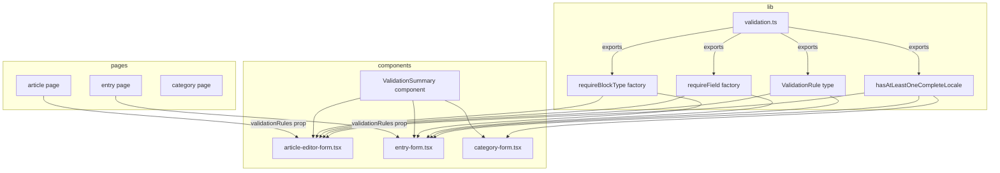

# Design Document: Multilingual Content Validation

## Overview

This feature introduces locale-agnostic save/publish gating across the three admin editor forms (Article, Entry, Category). Currently all three forms hard-code `locales.en.title.trim()` (or `name` for Category) as the sole submit guard. The new rule is: **at least one locale must have both its title/name AND its slug non-empty** before any save action is permitted.

The change ships as:

1. A new shared pure-function module (`lib/validation.ts`) with `hasAtLeastOneCompleteLocale`, `ValidationRule` type, `requireField`, and `requireBlockType`.
2. Updates to all three editor forms to use the new logic, update tab indicators, add inline slug helpers, and render a `ValidationSummary`.
3. A new `ValidationSummary` component (inline banner near the action buttons).

**Tech stack**: React 19, Next.js 16, TypeScript, shadcn/ui (Radix primitives), Vitest 4 + fast-check 4 for property-based tests.

---

## Architecture



Data flows in one direction: pages compose validation rules, pass them as props to editor forms, which evaluate them alongside `hasAtLeastOneCompleteLocale` on every render to produce the disabled state and error list displayed by `ValidationSummary`.

---

## Components and Interfaces

### 1. `apps/admin/src/lib/validation.ts` (new file)

```typescript
/**
 * A locale-agnostic record of locale states.
 * Each value must have at least a title/name string and a slug string.
 */
export interface LocaleEntry {
  title?: string;   // used by Article / Entry
  name?: string;    // used by Category
  slug: string;
}

/**
 * Returns true iff at least one locale has both its primary label
 * (title or name) and slug non-empty after trimming.
 */
export function hasAtLeastOneCompleteLocale(
  locales: Record<string, LocaleEntry>,
): boolean

/**
 * A pure function that checks form values and returns:
 *   null   — rule passes
 *   string — rule fails with this message
 */
export type ValidationRule<T = Record<string, unknown>> = (values: T) => string | null;

/**
 * Factory: creates a rule that fails when values[fieldKey] is falsy.
 */
export function requireField<T extends Record<string, unknown>>(
  fieldKey: keyof T & string,
  message?: string,
): ValidationRule<T>

/**
 * Factory: creates a rule that fails when no block with the given
 * `type` and `visible: true` exists in values.blocks.
 */
export interface BlockLike { type: string; visible: boolean }
export interface WithBlocks { blocks: BlockLike[] }

export function requireBlockType<T extends WithBlocks>(
  blockType: string,
  message?: string,
): ValidationRule<T>
```

`hasAtLeastOneCompleteLocale` iterates over `Object.values(locales)` — not key order — ensuring order independence. The helper resolves the primary label as `entry.title ?? entry.name ?? ''` to support both Article/Entry (`title`) and Category (`name`) shapes without branching in the form components.

### 2. `apps/admin/src/components/ui/validation-summary.tsx` (new file)

```typescript
interface ValidationSummaryProps {
  /** Array of failing error messages. When empty, the component renders nothing. */
  errors: string[];
  className?: string;
}

export function ValidationSummary({ errors, className }: ValidationSummaryProps): JSX.Element | null
```

Renders a styled banner containing an unordered list of messages when `errors.length > 0`. Uses amber/yellow tones to distinguish from API toast errors. Visually matches the existing inline helper text style but is more prominent (bordered card).

### 3. `apps/admin/src/components/articles/article-editor-form.tsx` (updated)

**Props changes:**

```typescript
export interface ArticleEditorFormProps {
  // ...existing props...
  validationRules?: ValidationRule<ArticleEditorFormValues>[];
}
```

**Internal logic changes:**

```typescript
// Replace:
const isSubmitDisabled = isSubmitting || !locales.en.title.trim();

// With:
const LOCALE_COMPLETENESS_MESSAGE =
  'At least one language must have both a title and slug filled.';

const localeErrors: string[] = hasAtLeastOneCompleteLocale(locales)
  ? []
  : [LOCALE_COMPLETENESS_MESSAGE];

const ruleErrors: string[] = (validationRules ?? [])
  .map((rule) => rule(buildValues()))
  .filter((msg): msg is string => msg !== null);

const allErrors = [...localeErrors, ...ruleErrors];
const isSubmitDisabled = isSubmitting || allErrors.length > 0;
```

**Tab indicator (updated):**

```tsx
// Replace `hasTitle` check with:
const isComplete =
  locales[locale].title.trim().length > 0 &&
  locales[locale].slug.trim().length > 0;
```

**Save Draft button (updated):**
The `Save draft` button now uses the same `isSubmitDisabled` flag (was previously only gated on `isSubmitting`).

**ValidationSummary placement:**
Rendered between the tab list and tab content, as an inline banner above the first locale card.

**Inline slug helper** (inside `LocaleTabContent`):
```tsx
{state.title.trim() && !state.slug.trim() && (
  <p className="text-xs text-amber-600">
    Add a slug to make this locale complete.
  </p>
)}
```

**Tooltip on disabled Publish button:**
Wrap the Publish button in shadcn `<Tooltip>` when `isSubmitDisabled` is true and `allErrors.length > 0`.

### 4. `apps/admin/src/components/entries/entry-form.tsx` (updated)

Identical changes to Article form. The `requireBlockType` rule checks `values.locales[locale].blocks` — but per the `requireBlockType` signature, `values.blocks` is a flat array. For EntryForm, since blocks live per-locale, a custom rule factory can flatten all locale blocks before checking. The built-in `requireBlockType` factory receives the flat block array from whichever locale is active, so callers need to supply a custom rule wrapping all locales if cross-locale block checking is needed. This is documented in JSDoc.

```typescript
export interface EntryFormProps {
  // ...existing props...
  validationRules?: ValidationRule<EntryFormValues>[];
}
```

### 5. `apps/admin/src/components/categories/category-form.tsx` (updated)

CategoryForm does **not** receive a `validationRules` prop (per requirements 8.2-8.3, only Article and Entry need it). Changes:

- Replace `isSubmitDisabled = isSubmitting || !locales.en.name.trim() || !type`
  with:
  ```typescript
  const localeValid = hasAtLeastOneCompleteLocale(locales);
  const isSubmitDisabled = isSubmitting || !localeValid || !type;
  ```
- Tab indicator: update `isLocaleTranslated` to check both `name` and `slug`.
- Add inline slug helper in `LocaleTabContent`.
- Add `ValidationSummary` below tab list (showing locale completeness error when locale is invalid).
- Wrap disabled Save button in a Tooltip.

---

## Data Models

### `LocaleEntry` (validation utility)

```
{
  title?: string   // Article, Entry
  name?: string    // Category
  slug: string
}
```

The function treats both `title` and `name` as the "primary label". Only one needs to be present per entity type.

### `ValidationRule<T>`

```
(values: T) => string | null
```

Pure function. `T` is the form values type specific to each editor form. Rules are evaluated at render time (derived state), not on submit.

### `AllErrors[]` (derived state, not persisted)

```typescript
type AllErrors = string[];
// produced by: [...localeErrors, ...ruleErrors]
```

### Locale completeness predicate

```
isComplete(locale) = trim(locale.title ?? locale.name ?? '') !== ''
                   && trim(locale.slug) !== ''
hasAtLeastOneCompleteLocale(locales) = Object.values(locales).some(isComplete)
```

### Inline slug helper visibility predicate

```
showHelper(locale) = trim(primaryLabel(locale)) !== ''
                   && trim(locale.slug) === ''
```

---

## Implementation Approach per Requirement

### Req 1 — Shared Validation Logic
Create `apps/admin/src/lib/validation.ts`. Export `hasAtLeastOneCompleteLocale` using `Object.values` iteration to be key-order-independent. Export `ValidationRule` as a TypeScript type alias. Export `requireField` and `requireBlockType` as factory functions.

### Req 2 & 3 — Article/Entry Editor Validation
In each form: replace the hard-coded `!locales.en.title.trim()` with `hasAtLeastOneCompleteLocale` + `validationRules` evaluation. Apply `isSubmitDisabled` to **both** Publish and Save Draft buttons. Currently, `entry-form.tsx` Save Draft only gates on `isSubmitting`; add `&& !allErrors.length` gating.

### Req 4 — Category Editor Validation
Replace `!locales.en.name.trim()` with `!hasAtLeastOneCompleteLocale(locales)`. Preserve `!type` condition. No `validationRules` prop needed.

### Req 5 — Tab Indicators
In all three forms, update the tab dot condition from `title.trim().length > 0` to `title.trim().length > 0 && slug.trim().length > 0` (or `name` for Category). The existing Tailwind classes (`bg-green-500` / `bg-transparent`) remain unchanged.

### Req 6 — Inline Slug Helper
Add a short conditional paragraph beneath the slug `Input` inside each form's `LocaleTabContent`. Condition: `primaryLabel.trim() !== '' && slug.trim() === ''`.

### Req 7 — Consistency Across Save Actions
Both buttons share the same `isSubmitDisabled` derived value. The `isSubmitting` short-circuit remains as the first clause to preserve existing loading behavior.

### Req 8 — Extensible Rule System
`ValidationRule<T>` type + `requireField` + `requireBlockType` in `validation.ts`. Props added to `ArticleEditorFormProps` and `EntryFormProps`. Rules are evaluated inline during render using `useMemo` to avoid unnecessary recomputation.

```typescript
const allErrors = useMemo(() => {
  const localeErr = hasAtLeastOneCompleteLocale(locales) ? [] : [LOCALE_COMPLETENESS_MESSAGE];
  const ruleErrs = (validationRules ?? [])
    .map((r) => r(buildValues()))
    .filter((m): m is string => m !== null);
  return [...localeErr, ...ruleErrs];
}, [locales, validationRules, /* other deps */]);
```

### Req 9 — Validation Summary
`ValidationSummary` component receives `errors: string[]`. When non-empty it renders an amber-bordered box with a list. This replaces any ad-hoc disabled tooltip copy as the primary error surface. The Tooltip on the disabled button is a secondary affordance (hover discovery); the banner is the primary affordance.

---

## Error Handling

- **Empty validationRules array**: treated same as omitted — zero rule errors.
- **Rule throws**: rules are expected to be pure functions. If a rule throws, the error propagates and should be caught at the component boundary. Developers should write safe rules; the form does not silently swallow rule exceptions.
- **isSubmitting race**: `isSubmitting` is always checked first; even if locale validity changes while a request is in flight, the buttons remain disabled.
- **Slug auto-generation**: the existing `toSlug` / `slugManuallyEdited` logic is unchanged; the new indicator reflects whether the resulting slug is non-empty.

---

## Testing Strategy

The project uses **Vitest 4** with jsdom and **@testing-library/react** for component tests, and **fast-check 4** for property-based tests. Both are already in `devDependencies`.

### Unit tests (`validation.ts`)

- `hasAtLeastOneCompleteLocale` with explicit examples: all empty, mixed, all complete.
- `requireField`: returns null for truthy field, message for falsy.
- `requireBlockType`: returns null when matching visible block exists, message otherwise.

### Property-based tests (`validation.ts`)

Implemented in `apps/admin/src/__tests__/validation.property.test.ts` using fast-check.

### Component tests (forms)

Implemented in `apps/admin/src/__tests__/` alongside validation tests. Use `@testing-library/react` + `userEvent`. Mock heavy dependencies (RichTextEditor, CoverImageUpload) as needed.

---

## Correctness Properties

*A property is a characteristic or behavior that should hold true across all valid executions of a system — essentially, a formal statement about what the system should do. Properties serve as the bridge between human-readable specifications and machine-verifiable correctness guarantees.*

### Redundancy Analysis

Before listing final properties, here is the reflection on redundancies:

- Req 1.2 (positive result) and 1.3 (negative result) collapse into one round-trip property over all inputs: "the function returns true iff at least one locale is complete".
- Req 5.1 and 5.2 (green when complete, not-green when incomplete) are two sides of the same biconditional — merged into one property.
- Req 2.2/2.3/3.2/3.3 (disabled when no complete locale) and 2.4/3.4 (enabled when one complete) can be stated as a single property per form: "button disabled state equals not(hasAtLeastOneCompleteLocale)".
- Req 7.3/7.4 (isSubmitting disables regardless) is a separate, orthogonal property.
- Req 8.7/8.8/8.9 (rule factories) each have independent semantics — kept separate.
- Req 9.1/9.5 (summary shows all failing messages) are merged into one property.

After reflection, the final set of non-redundant properties is:

---

### Property 1: `hasAtLeastOneCompleteLocale` is an if-and-only-if condition

*For any* record of locale entries, `hasAtLeastOneCompleteLocale(locales)` returns `true` if and only if at least one entry in the record has a non-empty (after trim) primary label (title or name) **and** a non-empty (after trim) slug.

**Validates: Requirements 1.2, 1.3**

### Property 2: `hasAtLeastOneCompleteLocale` is order-independent

*For any* locale record `r`, creating a new record `r'` with the same key-value pairs inserted in a different order produces the same result: `hasAtLeastOneCompleteLocale(r) === hasAtLeastOneCompleteLocale(r')`.

**Validates: Requirements 1.5**

### Property 3: Tab indicator color matches locale completeness

*For any* locale state, the tab indicator dot is rendered with `bg-green-500` if and only if both the primary label (title/name) and slug are non-empty after trimming — across all three form components.

**Validates: Requirements 5.1, 5.2, 5.3, 5.4, 5.5**

### Property 4: Inline slug helper visibility matches title-without-slug condition

*For any* locale state, the inline slug helper is rendered beneath the slug input if and only if the primary label is non-empty after trimming **and** the slug is empty after trimming.

**Validates: Requirements 6.1, 6.2, 6.3**

### Property 5: Submit buttons are disabled exactly when no locale is complete (and not submitting)

*For any* ArticleEditorForm or EntryForm state where `isSubmitting` is `false` and `validationRules` is empty or omitted, both the Publish and Save Draft buttons are disabled if and only if `hasAtLeastOneCompleteLocale(locales)` returns `false`.

**Validates: Requirements 2.2, 2.3, 2.4, 3.2, 3.3, 3.4, 7.1, 7.2**

### Property 6: `isSubmitting = true` disables all save actions regardless of locale state

*For any* ArticleEditorForm or EntryForm state, when `isSubmitting` is `true`, both the Publish and Save Draft buttons are disabled regardless of the current locale completeness or validation rules.

**Validates: Requirements 7.3, 7.4**

### Property 7: `requireField` passes iff the field is truthy

*For any* field key `k` and form values object `v`, `requireField(k)(v)` returns `null` if `v[k]` is truthy, and returns a non-empty string if `v[k]` is falsy (empty string, null, or undefined).

**Validates: Requirements 8.7**

### Property 8: `requireField` uses the caller-supplied message when provided

*For any* non-empty message string `msg`, field key `k`, and form values `v` where `v[k]` is falsy, `requireField(k, msg)(v) === msg`.

**Validates: Requirements 8.9**

### Property 9: `requireBlockType` passes iff a visible block of that type exists

*For any* block type string `t` and blocks array, `requireBlockType(t)(values)` returns `null` if and only if `values.blocks` contains at least one entry with `type === t` and `visible === true`.

**Validates: Requirements 8.8**

### Property 10: `requireBlockType` uses the caller-supplied message when provided

*For any* non-empty message string `msg`, block type `t`, and form values `v` where no visible block of type `t` exists, `requireBlockType(t, msg)(v) === msg`.

**Validates: Requirements 8.9**

### Property 11: ValidationSummary renders all failing rule messages

*For any* non-empty list of failing ValidationRules, the rendered form contains one visible error message in the ValidationSummary for **each** failing rule — none are omitted.

**Validates: Requirements 9.1, 9.5**

### Property 12: ValidationSummary is absent when all rules pass and locale is complete

*For any* form state where `hasAtLeastOneCompleteLocale` returns `true` and all `validationRules` return `null`, the ValidationSummary element is not rendered in the DOM.

**Validates: Requirements 9.3**

### Testing Implementation Notes

- **Library**: `fast-check` (already in devDependencies at `^4.8.0`)
- **Test runner**: `vitest --run` (single-pass mode, no watch)
- **Minimum iterations**: 100 per property test (fast-check default is 100)
- **Tag format**: `Feature: multilingual-content-validation, Property {n}: {short title}`
- **File**: `apps/admin/src/__tests__/validation.property.test.ts` for pure-function properties (Properties 1, 2, 7, 8, 9, 10); component properties (3, 4, 5, 6, 11, 12) in `apps/admin/src/__tests__/forms.property.test.ts`
- **Mocking**: `RichTextEditor`, `CoverImageUpload`, and other heavy components should be mocked at the test module level to keep component property tests fast and dependency-free
